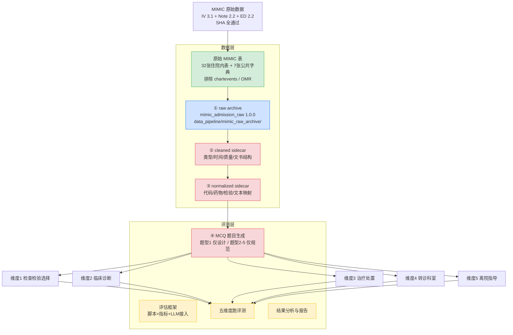

# MIMIC 临床 LLM Benchmark · 项目流程梳理与推进计划

> 更新日期：2026-08-10 ｜ 项目路径：`D:\Projects\llm_benchmark` ｜ 数据基线：MIMIC-IV 3.1 + Note 2.2 + ED 2.2

---

## 一句话定位

基于 **MIMIC** 构建临床 LLM 评测基准。当前原始住院归档 schema、分片续跑代码和清洗/标准化流程已经冻结，下一门禁是运行10,000例真实数据并做逐表 profiling。

## 两层架构

项目从下到上分为**数据层**和**评测层**，数据层的产物直接喂给评测层出题。

- **数据层**：MIMIC 原始表 → 单次住院 raw JSONL → cleaned sidecar → normalized sidecar。各层独立、可追溯，不覆盖原始数据。
- **评测层**：基于数据层产出，生成五类临床 MCQ 题目，再用题目评估 LLM 的五个维度临床判断能力。

> **旧版 17 列 CSV 路线**（`rwd_pipeline/`）：早期提取/清洗路线，已被数据层主线替代，保留代码和 spec 供参考。

动态读取规则属于评测层：只有入选题目才生成字段白名单、时间截断、后验排除和隐藏答案规则。

## 整体流程图

> draw.io 可编辑版本见同目录 `项目流程图.drawio`，颜色规则：绿色=已完成，蓝色=进行中，红色=阻塞，黄色=待办。

## 评测层：五个维度与数据就绪度

raw archive 保存原始表。以下可见数据必须在清洗/标准化后由动态读取 renderer 生成：

| 维度 | MCQ 题型（评测层向 LLM 提出的问题） | 题目设计 | 主要原始来源 |
|---|---|---|---|
| 1 检查检验选择 | "该患者下一步最可能开什么检查？" | Stage 0-10 设计完整 | `poe`, `poe_detail`, labs, microbiology, radiology |
| 2 临床诊断 | "该患者的诊断是什么？" | 仅题型规范 | ED diagnosis、文书、检查结果；出院 ICD 仅作后验标签 |
| 3 治疗处置 | "该患者的首选治疗方案？" | 仅题型规范 | prescriptions、pharmacy、eMAR、ICU input/procedure events |
| 4 转诊科室 | "该患者应转哪个科室？" | 仅题型规范 | services、transfers、icustays |
| 5 离院指导 | "该患者离院后如何随访？" | 仅题型规范 | discharge note；只在离院题的相应时点使用 |

## 推进顺序（门禁式）

按依赖关系排，**先完成数据层清洗标准化，再进入评测层出题**：

### 数据层

| 编号 | 任务 | 状态 | 说明 |
|---|---|---|---|
| T0 | 冻结 raw schema 和源表边界 | ✅ 已完成 | 32张住院表、7张公共字典、2张排除表 |
| T1 | ① raw archive | 🟡 代码完成 | 分片 staging、多进程、manifest 续跑和原始字段验证；待10,000例 |
| T2 | ② cleaned sidecar | 📋 流程已指定 | 类型/时间解释、质量标记、文书结构化、source row 可追溯 |
| T3 | ③ normalized sidecar | 📋 流程已指定 | 字典代码、药物、检验单位和文本术语映射 |

### 评测层

| 编号 | 任务 | 状态 | 说明 |
|---|---|---|---|
| T4 | 实现维度 1 出题（检查检验选择） | ⏳ 待 T2-T3 | 已有 Stage 0-10 设计，可直接编码 |
| T5 | 设计并实现维度 2-5 出题 | ⏳ 待 T2-T3 | 目前只有题型规范，需先补出题方案 |
| T6 | 评估框架设计 | ⏳ 待 T4-T5 | 评测脚本、指标、LLM 接入、`subject_id` 级划分防泄漏 |
| T7 | 五个维度逐一评测 | ⏳ 待 T6 | 含人工/自动审题门禁 |
| T8 | 结果分析与报告 | ⏳ 待 T7 | — |

## 关键判断

1. **当前门禁是 T1 的10,000例真实运行与逐表 profiling**，不是立即启动文本清洗。
2. **凭据已治理**：`run_*.sh` 改为 `source .env`，不再明文硬编码 Key。
3. **Git 已初始化**：目录结构已按功能重组，待推送 GitHub。

## 关键文件索引

| 文件 | 作用 |
|---|---|
| `docs/design/MIMIC评测数据集构建方法学.md` | 方法学全文 |
| `docs/design/mimic-multimodal-benchmark-guide.md` | 多模态 benchmark 指南 |
| `docs/design/clinical_episode_aggregation_plan.md` | Episode 聚合实施方案 |
| `docs/design/episode_field_mapping.md` | 字段级映射 |
| `docs/design/mimic-admission-raw-jsonl-schema.md` | 当前 raw JSONL 的全部字段和连接规则 |
| `docs/design/raw-archive-cleaning-standardization.md` | 清洗、标准化和动态读取流程 |
| `docs/reports/dashboard.html` | 动态进度仪表盘 |
| `docs/文件保存规范.md` | 目录职责与命名规范 |
| `mcq_generation/mcq_generation_design.md` | 题型 1 Stage 0-10 出题设计（T4 实现依据） |
| `mcq_generation/question_types.md` | 五类题型规范（T5 实现依据） |
| `tests/` | 测试套件（6 文件，覆盖抽取/清洗/标准化/episode pipeline） |
| `data_pipeline/mimic_raw_archive/` | 当前原始归档主线 |
| `data_pipeline/clean_clinical_archive/` | 字典解码与 POE 临床可读清洗 |
| `data_pipeline/archived/parquet_to_jsonl/` | 已归档的派生 visit archive 实验实现 |
| `data_pipeline/archived/mimic_episode/` | 已归档的 Episode 聚合管线 |
| `rwd_pipeline/` | 旧版 CSV 路线（抽取/清洗/标准化 + spec） |
