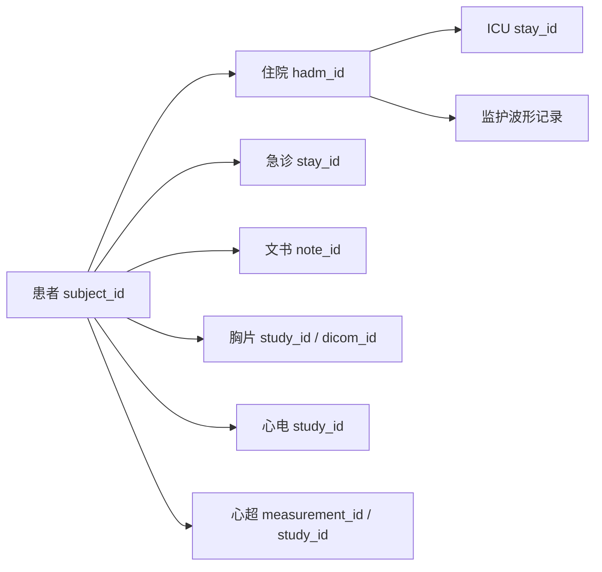

# MIMIC 多模态数据与 Benchmark 建设指南

> 适用项目：`医疗数据集评测-MIMIC`
> 基线版本：MIMIC-IV 3.1
> 核查日期：2026-08-04
> 范围：临床文本、结构化 EHR、胸片、诊断心电图、ICU 监护波形

## 1. 先给结论

当前本地的 `mimic-iv-3.1` 是结构化 EHR 数据库，不包含医生书写的完整临床文书。`hosp/emar.csv.gz` 中的 eMAR 指电子用药执行记录（electronic Medication Administration Record），不是泛指电子病历（EMR）。

要建设以文本处理和多模态评测为目标的 benchmark，推荐按以下顺序补齐数据：

1. **P0：MIMIC-IV-Note 2.2**——出院小结和放射学报告，是临床文本的主体。
2. **P0：MIMIC-IV-ED 2.2**——增加急诊主诉、分诊、院前用药核对和急诊过程。
3. **P1：MIMIC-CXR-JPG 2.1.0**——胸片、多标签和官方患者级划分；适合先建立影像—文本闭环。
4. **P1：MIMIC-IV-ECG 1.0**——约 80 万份 12 导联诊断心电图、机器测量和报告关联信息。
5. **P1/P2：MIMIC-IV-ECHO 1.0**——2026 年发布的心超结构化测量和 TTE DICOM；报告正文尚未公开。
6. **P1：MIT-LCP/mimic-code v3.0.0 或更新兼容版本**——复用已针对 MIMIC-IV 3.1 构建的官方派生概念。
7. **P2：MIMIC-CXR 2.1.0 DICOM**——只有在研究原始像素、位深、DICOM 元数据或临床影像处理时再下载。
8. **P3：MIMIC-IV Waveform 0.1.0**——目前只有 200 个记录、198 名患者，是技术预览，不适合作为核心 benchmark。
9. **P3：MIMIC-IV on FHIR 2.1**——只在研究互操作、FHIR 查询或工具调用时下载；它不增加新临床模态。

最关键的限制是**版本和时间覆盖不齐**：MIMIC-IV 3.1 加入了 2020—2022 年数据，而 Note、ED、ECG、CXR 等扩展模态主要覆盖较早时期。必须先计算实际交集，不能默认所有 MIMIC-IV 3.1 病例都有文本、影像或信号。

## 2. 本地数据现状

| 数据集 | 本地状态 | 压缩文件规模 | 完整性 | 主要内容 |
|---|---:|---:|---:|---|
| MIMIC-IV 3.1 | 已下载 | 9.92 GiB | SHA-256 33/33 通过 | `hosp`、`icu` 结构化事件 |
| MIMIC-III 1.4 | 已下载 | 6.17 GiB | SHA-256 30/30 通过 | 结构化 ICU 数据及 `NOTEEVENTS` |
| MIMIC-IV-Note | 已下载 | 1.83 GiB | SHA-256 5/5 通过 | 出院小结、放射学报告 |
| MIMIC-IV-ED | 已下载 | 116.3 MiB | SHA-256 8/8 通过 | 急诊主诉、分诊、用药、诊断 |
| MIMIC-CXR / JPG | 未发现 | — | — | 胸片、报告、标签和划分 |
| MIMIC-IV-ECG | 未发现 | — | — | 12 导联 ECG、机器测量、报告链接 |
| MIMIC-IV Waveform | 未发现 | — | — | ICU 连续波形和监护数值 |
| MIMIC-IV-ECHO | 未发现 | — | — | 心超结构化测量和 TTE DICOM |
| MIMIC-IV on FHIR | 未发现 | — | — | MIMIC-IV/ED 的 FHIR 重编码 |

本地流式计数确认 MIMIC-IV 3.1 包含 364,627 名患者、546,028 次住院（223,452 名患者）和 94,458 次 ICU stay（65,366 名患者）。计数过程只读取主键，不输出患者级记录。

原始数据目录、派生患者数据、Parquet、DuckDB 和输出目录已由 `.gitignore` 排除。Git 只管理代码、配置、测试和不含患者级内容的文档。

## 3. MIMIC 数据体系

### 3.1 核心标识符



- `subject_id`：患者级标识；同一患者的所有住院、文书和可关联模态应保持一致。
- `hadm_id`：一次医院住院；不是所有急诊、影像或 ECG 都能匹配到住院。
- `stay_id`：一次科室停留。ICU 和 ED 都使用该名称，但必须结合模块解释。
- `note_id`：一份文书；不能用它代替住院主键。
- `study_id`：一项影像或 ECG 检查；不同模态的 `study_id` 不应脱离模块直接混用。
- `dicom_id`：一张胸片图像；一个胸片 study 可以包含多张图像。

### 3.2 模块边界

| 模块 | 数据来源 | 典型粒度 | 能回答的问题 | 不能代表什么 |
|---|---|---|---|---|
| `hosp` | 全院 EHR | 住院、医嘱、药物、化验事件 | 诊断、检查、治疗、转科 | 完整医生叙述 |
| `icu` | MetaVision ICU 系统 | 分钟级或事件级 | 生命体征、输入输出、操作 | 完整护理/病程文书 |
| `ed` | 急诊系统 | 急诊停留和事件 | 主诉、分诊、急诊过程 | 完整急诊病历正文 |
| `note` | 全院文书系统 | 文书级 | 出院经过、报告文本 | 全量病程、护理、会诊文书 |
| `cxr` | 放射影像系统 | study/image | 胸片—报告分析 | 全部影像模态 |
| `ecg` | 诊断 ECG 设备 | 10 秒检查级 | 心电信号、机器测量 | ICU 连续监护 |
| ECHO | 心超系统 | 测量/研究/序列级 | 心脏结构、功能、视频序列 | 已公开心超报告正文 |
| Waveform | 床旁监护仪 | 连续信号记录 | ECG/PPG/ABP/呼吸波形 | 大规模稳定队列（当前版本） |
| FHIR | hosp/ED 重编码 | FHIR resource | 互操作、标准接口与查询 | 新患者或新临床模态 |

官方模块总览见 [MIMIC Modules](https://mimic.mit.edu/docs/IV/modules/) 和 [Schema overview](https://mimic.mit.edu/docs/IV/about/schema-overview.html)。

## 4. MIMIC-IV 3.1 中现有的文本信息

逐表字段级清单见 [MIMIC-IV 3.1 文本字段清单](mimic-iv-3.1-text-field-inventory.md)。

### 4.1 不属于完整病历正文的文本

| 表 | 文本字段或字段组 | 性质 | 可用于的任务 |
|---|---|---|---|
| `d_icd_diagnoses` | `long_title` | ICD 术语 | 编码名称、标签解释 |
| `d_icd_procedures` | `long_title` | ICD 操作术语 | 操作编码映射 |
| `d_hcpcs` | `long_description`, `short_description` | 计费术语 | 术语归一化 |
| `d_labitems` | `label`, `fluid`, `category` | 化验项目字典 | 检查名称标准化 |
| `drgcodes` | `description` | DRG 描述 | 住院分组标签 |
| `hcpcsevents` | `short_description` | 事件描述 | 操作事件文本化 |
| `prescriptions` | `drug`, `prod_strength`, `route` 等 | 药物短文本 | 药物归一化、处方解析 |
| `pharmacy` | `medication`, `route`, `frequency` 等 | 药房工作流文本 | 用药计划重建 |
| `emar` | `medication`, `event_txt` | 用药执行短文本 | 给药状态和时序 |
| `emar_detail` | 给药原因、产品、途径、部位等 | 半结构化短文本 | 用药执行细节抽取 |
| `poe_detail` | `field_name`, `field_value` | 医嘱属性—值 | 医嘱语义重建 |
| `labevents` | `value`, `flag`, `comments` | 结果值和少量备注 | 异常结果、结果备注抽取 |
| `microbiologyevents` | 标本、试验、菌名、药敏、`comments` | 半结构化微生物文本 | 培养和耐药关系抽取 |
| `omr` | `result_name`, `result_value` | 门诊记录型属性—值 | 病史测量和长期趋势 |
| `services`, `transfers` | 科室、单元、事件类别 | 枚举型文本 | 医疗路径重建 |
| `icu/d_items` | `label`, `abbreviation`, `category` | ICU 项目字典 | 事件名称映射 |
| `icu/chartevents` | `value` | 数值或短文本观察 | 状态、设备、评分和床旁记录 |
| ICU 其他事件表 | 状态、位置、类别字段 | 工作流短文本 | 操作与治疗过程重建 |

这些字段可以组成“结构化 EHR 的可读序列”，但不能冒充医生原始病历。若将它们模板化为文本，必须保留：来源表、原始字段、时间戳、单位、缺失状态和转换版本。

### 4.2 MIMIC-IV 3.1 没有的正文

当前本地 MIMIC-IV 3.1 没有以下完整文书：

- 入院记录正文；
- 日常病程记录；
- ICU 护理交班文本；
- 会诊记录；
- 手术记录正文；
- 完整急诊医生记录；
- 门诊随访记录；
- 全量医患沟通和出院后依从性记录。

### 4.3 MIMIC-III 的文本优势与局限

本地 MIMIC-III 1.4 包含 `NOTEEVENTS.csv.gz`，字段包括 `CATEGORY`、`DESCRIPTION` 和 `TEXT`。它的文书类型比公开的 MIMIC-IV-Note 更丰富，因此仍适合：

- 多类型文书分类；
- 护理与医生记录的信息抽取；
- 跨文书时间线和重复信息研究；
- MIMIC-III 到 MIMIC-IV 的域迁移评测。

但 MIMIC-III 与 MIMIC-IV 的患者 ID、数据年代、系统结构和编码体系不同，不能把两者当作同一患者纵向合并。更合理的用途是外部时间域验证或跨版本泛化，而不是直接拼接训练后随机划分。

## 5. 推荐下载清单

### 5.1 P0：MIMIC-IV-Note 2.2

官方页面：[MIMIC-IV-Note 2.2](https://physionet.org/content/mimic-iv-note/2.2/)

包含四张表：

- `discharge`：331,794 份去标识化出院小结，145,915 名患者；
- `discharge_detail`：出院小结附加信息；
- `radiology`：2,321,355 份去标识化放射学报告，237,427 名患者；
- `radiology_detail`：检查名称、CPT、父报告/附加报告关系等。

价值：

- 出院小结是住院过程、诊断、治疗和出院计划的长文本；
- 放射学报告是稳定的半结构化文本，可用于章节抽取、实体关系、摘要和报告一致性；
- 可通过 `subject_id`、可用时的 `hadm_id`、`note_id` 和时间字段关联 EHR。

限制：

- 公开说明只包含出院小结和放射学报告，不是完整纵向文书库；
- 基于较早 MIMIC-IV 版本，不能假定覆盖 3.1 新增的 2020—2022 年病例；
- 出院小结包含大量结局后信息，不能作为入院时预测输入。

### 5.2 P0：MIMIC-IV-ED 2.2

官方页面：[MIMIC-IV-ED 2.2](https://physionet.org/content/mimic-iv-ed/2.2/)

约 425,000 次急诊停留，包含：

- `edstays`：到离院时间、去向、交通方式；
- `triage`：`chiefcomplaint`、分诊生命体征、疼痛、分级；
- `vitalsign`：急诊过程生命体征、节律、疼痛；
- `medrecon`：入急诊前用药；
- `pyxis`：急诊药柜取药；
- `diagnosis`：急诊出院后编码诊断。

文本价值主要来自 `chiefcomplaint`、药物名称、诊断标题、节律和疼痛字段。它增加的是“早期临床状态”，不是完整急诊病历正文。

### 5.3 P1：MIMIC-CXR-JPG 2.1.0

官方页面：[MIMIC-CXR-JPG 2.1.0](https://physionet.org/content/mimic-cxr-jpg/2.1.0/)

包含 377,110 张 JPG 胸片和对应 227,827 份检查报告产生的结构化标签，并提供：

- 图像元数据；
- 官方 train/validate/test 划分；
- CheXpert 标签；
- NegBio 标签；
- 人工标注测试集标签；
- `IMAGE_FILENAMES`/`RECORDS`，支持只下载队列所需图像。

建议先下载 CSV 元数据、标签和文件清单，完成队列交集后再按 `subject_id`/`study_id` 下载图像子集。这样比一开始下载全部图像更直接，也避免保存大量永远不会进入 benchmark 的文件。

### 5.4 P2：MIMIC-CXR 2.1.0 DICOM

官方页面：[MIMIC-CXR 2.1.0](https://physionet.org/content/mimic-cxr/2.1.0/)

选择 DICOM 的理由应是：

- 需要原始位深和灰度信息；
- 需要 DICOM 元数据；
- 研究窗宽窗位、医学图像预处理或临床可解释性；
- 需要验证 JPG 转换带来的信息损失。

如果目标只是建立影像分类、图文检索或报告生成 benchmark，优先使用 JPG 版本。

### 5.5 P1：MIMIC-IV-ECG 1.0

官方页面：[MIMIC-IV-ECG 1.0](https://physionet.org/content/mimic-iv-ecg/1.0/)

- 约 800,000 份诊断 ECG；
- 近 160,000 名患者；
- 12 导联、10 秒、500 Hz；
- WFDB 格式；
- 解压约 90.4 GB，官方 ZIP 约 33.8 GB；
- `record_list.csv`：`subject_id`、`study_id` 和文件路径；
- `machine_measurements.csv`：机器测量和 `report_0..report_17` 机器生成文本；
- `waveform_note_links.csv`：ECG 与心电报告 `note_id` 的关联信息。

需要注意：

- ECG 设备时钟可能与 EHR 明显不同步；
- 部分 ECG 发生在门诊或住院时间窗外；
- v1.0 不直接发布敏感的心电医生报告正文，只提供与 Note 模块的链接；
- 当前公开 MIMIC-IV-Note 2.2 文档只列出 discharge/radiology 四张表，因此 ECG 报告正文的实际可用性必须在获得数据后验证，不能预先假定存在。

### 5.6 P1/P2：MIMIC-IV-ECHO 1.0

官方页面：[MIMIC-IV-ECHO 1.0](https://physionet.org/content/mimic-iv-echo/1.0/)

这是 2026-03 发布的关键心血管多模态扩展：

- `structured_measurement.csv`：206,488 个研究、91,372 名患者；
- 研究类型包括 179,928 个 TTE、16,389 个 stress echo 和 10,171 个 TEE；
- 结构化测量覆盖 2008—2022，包含心腔、收缩/舒张功能、瓣膜和多普勒血流等；
- DICOM 子集约 525,000 个文件、7,243 个 TTE 研究、4,579 名患者，主要来自 2017—2019；
- `echo-record-list.csv` 连接 DICOM 路径、时间、`study_id` 和 `subject_id`；
- `echo-study-list.csv` 提供 DICOM、两日内结构化测量和报告 `note_id` 的派生链接。

注意：心超报告正文仍注明未来在 MIMIC-IV-Note 发布，目前不能作为已公开文本使用。结构化测量覆盖范围远大于 DICOM 子集，且不同心超系统时期存在变量名和可用性漂移。

建议先下载结构化测量和两个索引表，完成队列和变量审计后，再决定是否下载 DICOM。

### 5.7 P3：MIMIC-IV Waveform 0.1.0

官方页面：[MIMIC-IV Waveform 0.1.0](https://physionet.org/content/mimic4wdb/0.1.0/)

包含床旁监护 ECG、PPG、呼吸、有创/无创血压等波形和数值，但当前版本只有 200 个记录、198 名患者，解压约 12.8 GB。适合：

- 验证 WFDB 读取；
- 开发波形切窗和信号质量流程；
- 做小规模可行性实验。

不适合：

- 作为稳定的大样本主 benchmark；
- 划分复杂训练/验证/测试队列；
- 对罕见结局做可靠统计推断。

### 5.8 P3：MIMIC-IV on FHIR 2.1

官方页面：[MIMIC-IV on FHIR 2.1](https://physionet.org/content/mimic-iv-fhir/2.1/)

它把 MIMIC-IV 2.2 和 MIMIC-IV-ED 2.2 映射为 FHIR NDJSON。它的价值是互操作、FHIR 查询、工具调用和 EHR Agent 接口评测，不增加患者、文本、影像或信号。若主线是文本理解、预测或多模态表征，直接使用 CSV/Parquet 更简单。

### 5.9 P1：MIMIC Code Repository

官方仓库：[MIT-LCP/mimic-code](https://github.com/MIT-LCP/mimic-code)

官方 v3.0.0 release 已声明用 MIMIC-IV 3.1 重建 `mimiciv_derived`。优先复用其概念定义，如年龄、生命体征、通气、严重程度评分和标准队列，避免每个 benchmark 各自重新解释原始 `itemid`。

## 6. 版本兼容矩阵

| 数据集 | 当前建议版本 | 主要时间范围/父版本 | 与本地 MIMIC-IV 3.1 的处理方式 |
|---|---|---|---|
| MIMIC-IV | 3.1 | 2008—2022 | 主 EHR 基线 |
| MIMIC-IV-Note | 2.2 | 较早 MIMIC-IV 范围 | 实测 `subject_id/hadm_id` 交集 |
| MIMIC-IV-ED | 2.2 | 2011—2019 | 通过 `subject_id/hadm_id/stay_id` 关联 |
| MIMIC-CXR/JPG | 2.1.0 | 胸片主要来自 2011—2016 | 通过 `subject_id/study_id/dicom_id` 关联 |
| MIMIC-IV-ECG | 1.0 | 2008—2019；父版本 2.2 | 通过 `subject_id/study_id` 加时间窗匹配 |
| MIMIC-IV-ECHO | 1.0 | 测量 2008—2022；DICOM 2017—2019；父版本 2.2 | 测量、DICOM 和报告链接分别审计 |
| MIMIC-IV Waveform | 0.1.0 | 父版本 2.0；198 名患者 | 单独作为技术预览队列 |
| MIMIC-IV on FHIR | 2.1 | 重编码 MIMIC-IV/ED 2.2 | 只用于 FHIR/互操作任务 |
| mimic-code | v3.0.0+ | v3.0.0 对齐 MIMIC-IV 3.1 | 固定 release/commit 后复用 |

兼容性验证必须输出：

- 各模态 `subject_id` 覆盖率；
- 可匹配 `hadm_id` 的比例；
- 模态事件位于住院/急诊时间窗内的比例；
- 一对多、多对一和无法匹配的数量；
- 版本、校验和、提取代码 commit 和运行参数。

## 7. Benchmark 的病例表示

建议建立三个互相独立的数据层，而不是只生成一份“大 JSON”。

### 7.1 原始索引层

只存来源定位信息：

```text
subject_id
hadm_id
icu_stay_id
ed_stay_id
note_id
cxr_study_id
dicom_id
ecg_study_id
echo_measurement_id
echo_study_id
waveform_record
source_dataset
source_version
source_path
event_time
```

### 7.2 规范化事件层

统一为：

```text
case_id
event_time
event_type
concept_id
concept_name
value
unit
text
source_table
source_row_key
available_time
```

`event_time` 表示临床事件发生时间，`available_time` 表示模型在真实流程中最早能看到该信息的时间。二者分离是防止时间泄漏的关键。

### 7.3 任务样本层

每项任务单独生成：

```text
example_id
subject_id
index_time
observation_start
observation_end
input_references
target
label_source
split
exclusion_reason
pipeline_version
```

## 8. 推荐 Benchmark 任务矩阵

| 任务 | 输入 | 标签/目标 | 主指标 | 主要风险 |
|---|---|---|---|---|
| 文书章节识别 | 出院小结/报告 | 章节边界 | span F1 | 模板差异、空章节 |
| 临床实体关系抽取 | 文书 | 实体和关系标注 | entity/relationship F1 | 缺少人工金标准 |
| ICD 多标签编码 | 截止编码前可见文本 | ICD-9/10 | micro/macro F1、P@k | 出院后编码泄漏 |
| 临床检索 | 问题或事实 | 证据片段 | Recall@k、nDCG | 同文书近重复 |
| 时间线重建 | 文本+结构化事件 | 事件顺序/时间 | F1、顺序一致性 | chart/store 时间混用 |
| 忠实摘要 | 截止时点前的病例包 | 后续文书或人工摘要 | 事实支持率+人工评分 | ROUGE 奖励复制和幻觉 |
| 院内结局预测 | 固定观察窗 EHR | 死亡、转 ICU 等 | AUROC、AUPRC、Brier、ECE | 使用结局后记录 |
| 再入院预测 | 出院前信息 | 后续住院 | AUROC、AUPRC | 随访不完整、竞争风险 |
| 胸片分类 | CXR 图像 | 人工/规则标签 | AUROC、AUPRC、校准 | 报告派生标签不是独立金标准 |
| 胸片报告生成 | CXR 图像 | 报告 findings/impression | 临床实体 F1+事实错误率 | 文本相似度掩盖临床错误 |
| 图文检索 | CXR 与报告 | 匹配关系 | Recall@K、MRR | 同患者相邻检查过于相似 |
| ECG 多标签分类 | 12 导联波形 | 机器/医生解释 | macro AUROC/AUPRC | 机器报告是弱标签 |
| ECG—EHR 融合 | ECG+既往 EHR | 临床结局/表型 | 判别+校准指标 | ECG 时间戳不同步 |
| 心超测量预测 | TTE DICOM 序列 | 临床核验测量 | MAE、相关性、校准 | 同研究测量泄漏、系统漂移 |
| 心超—EHR 融合 | 心超测量/序列+EHR | 心功能/结局 | 判别+校准指标 | DICOM 子集选择偏倚 |
| 多模态一致性 | 文本+EHR+信号/影像 | 一致/矛盾证据 | macro F1+人工复核 | 构造负例过于简单 |
| 波形预警（试验） | 波形窗口+EHR | 未来事件 | AUPRC、提前量 | 样本太小、窗口泄漏 |

## 9. 数据划分与泄漏控制

### 9.1 硬性规则

1. 所有任务按 `subject_id` 划分，不能只按 `hadm_id`、文书或图像随机划分。
2. 同一患者的所有文本、影像、ECG 和波形必须进入同一 split。
3. 先冻结患者 split，再生成任务样本和窗口。
4. 使用官方 CXR split 时，其他模态必须跟随患者所属 split。
5. 不允许用测试集选择提示词、阈值、检索参数或清洗规则。
6. 报告均值时同时给患者级 bootstrap 95% CI。

### 9.2 常见泄漏

| 泄漏来源 | 为什么发生 | 根本处理 |
|---|---|---|
| 出院小结预测院内结局 | 小结在结局后形成 | 按 `available_time` 截断或禁用 |
| ICD/DRG 预测诊断 | 编码由出院后结算产生 | 明确任务是“编码复现”还是“早期诊断” |
| 报告文本预测胸片标签 | 标签由同一报告自动抽取 | 只能评价标签器复现，不能称独立影像诊断 |
| ECG 机器报告作为输入和标签 | 同一设备输出重复 | 输入与标签来源隔离 |
| 同患者多次检查跨集合 | 患者特征和既往结果重复 | `subject_id` 级划分 |
| 连续波形相邻窗口跨集合 | 信号高度重叠 | 先按患者/记录划分，再切窗 |
| 时间字段误用 | `storetime`、`charttime`、设备时钟不同 | 定义临床时间和可见时间 |
| 治疗作为病情标签 | 治疗受医生行为和资源影响 | 明确是行为预测还是疾病标签 |

## 10. 标签可信度分级

所有 benchmark 标签应标注来源等级：

- **A：人工判读/人工标注**——可作为主要金标准，但仍需报告一致性。
- **B：临床工作流结果**——如医生报告、实验室结果；是真实记录，不等于无误金标准。
- **C：编码/规则派生**——ICD、DRG、CheXpert/NegBio、机器 ECG 报告；适合作为弱标签。
- **D：研究者构造**——规则负例、LLM 生成标签；只能在独立人工审计后使用。

报告中不能把 C/D 级标签描述成“真实诊断金标准”。

## 11. 评测规范

### 11.1 最小基线梯度

每个任务至少包含：

1. 频率/规则基线；
2. 传统线性或树模型；
3. 单模态深度模型；
4. 简单早期/晚期融合；
5. 待评测多模态模型。

模型比较时固定队列、输入窗口、标签、数据划分、训练预算和评测代码。多模态模型不能通过额外看到未来信息获得不公平优势。

### 11.2 指标原则

- 类别不平衡任务：AUPRC 必须报告，AUROC 不能单独使用。
- 临床决策任务：报告校准（Brier、ECE、校准图）。
- 生成任务：文本相似度只能作为辅助，必须增加事实支持率、遗漏率、严重错误率。
- 检索任务：报告证据级 Recall@K/nDCG，不只看最终回答正确率。
- 多模态任务：同时报告完整模态、单模态和模态缺失性能。
- 所有主要指标给 95% CI，并明确统计单位是样本、住院还是患者。

## 12. 数据治理和外部模型

MIMIC-IV、MIMIC-III、Note、ED、CXR/JPG 等受限数据不能进入 Git，也不能公开发布派生的患者级文本、embedding、特征或可逆样本。

PhysioNet 明确指出，credentialed/restricted 数据不能被分享给第三方，包括直接发送到一般在线 LLM API。项目默认规则应是：

- 优先使用本地部署模型；
- 不把病例文本、图像或结构化患者记录粘贴到在线聊天或普通 API；
- 若机构批准使用云服务，必须独立核查零保留、不训练、无人审查和访问控制；
- 不把“已去标识化”理解为“可以公开上传”；
- 公开发布代码、字段字典、汇总统计和不可逆的合规结果，不发布原始或派生患者数据。

官方说明见 [Responsible use of MIMIC data with online services](https://physionet.org/news/post/gpt-responsible-use/) 和 [PhysioNet Credentialed Health Data DUA](https://physionet.org/content/clinical-t5/view-dua/1.0.0/)。

## 13. 推荐的第一阶段落地路线

### Gate 0：下载与合规

- 获取 Note 2.2、ED 2.2；
- 获取 CXR-JPG 元数据、标签、split 和所需图像子集；
- 获取 ECG 1.0 的三个索引 CSV，先不下载全部波形；
- 固定数据版本和校验和；
- 确认所有运行环境均不向外发送数据。

### Gate 1：交集审计

- 生成患者级模态覆盖矩阵；
- 计算各模态进入住院/急诊时间窗的比例；
- 找出 text-only、text+EHR、CXR+text、ECG+EHR 和全模态子队列；
- 若某子队列样本量不足，停止把它设计成主要论文任务。

### Gate 2：文本与 EHR benchmark

- 出院小结章节识别；
- 放射学报告结构化抽取；
- 住院病例证据检索；
- 固定时点的结局预测与校准。

### Gate 3：胸片多模态 benchmark

- 使用官方患者 split；
- 做图像分类、图文检索和报告事实一致性；
- 把自动报告标签和人工测试标签分开报告。

### Gate 4：ECG 多模态 benchmark

- 先用索引、机器测量和小规模波形子集验证；
- 解决 ECG 设备时间偏移；
- 再决定是否下载全部约 33.8 GB 压缩波形。

### Gate 5：监护波形可行性

- 只作为读取、对齐、信号质量和切窗技术验证；
- 在公开版本仍为 0.1.0/198 患者时，不设为主要大样本 benchmark。

### Gate 6：心超与 FHIR 扩展

- 先审计 ECHO 结构化测量变量和 DICOM 可用交集；
- 将心超结构化测量作为临床核验标签时，隔离同研究派生字段；
- 心超报告正文发布前，不设计报告生成主任务；
- 只有在明确研究 EHR 互操作或 Agent 工具调用时才引入 FHIR。

## 14. 第一阶段应下载什么

按投入产出比，第一批建议：

```text
必须：MIMIC-IV-Note 2.2 全部
必须：MIMIC-IV-ED 2.2 全部
必须：MIMIC-CXR-JPG 2.1.0 的元数据、标签、split、RECORDS
必须：MIMIC-IV-ECG 1.0 的 record_list、machine_measurements、waveform_note_links
建议：MIMIC-IV-ECHO 1.0 的 structured_measurement、echo-record-list、echo-study-list
必须：MIT-LCP/mimic-code 固定到兼容 MIMIC-IV 3.1 的 release/commit

队列确定后再下载：CXR-JPG 图像子集
任务确定后再下载：ECG WFDB 波形
队列确定后再下载：ECHO DICOM 子集
暂缓：CXR DICOM 全量
暂缓：MIMIC-IV Waveform 0.1.0 全量
暂缓：MIMIC-IV on FHIR 2.1
```

这样可以先回答“有多少患者能形成哪些多模态组合”，再把存储和计算投入放到实际可用队列上。

## 15. 官方来源

- [MIMIC-IV 3.1](https://physionet.org/content/mimiciv/3.1/)
- [MIMIC-IV 官方文档](https://mimic.mit.edu/docs/IV/)
- [MIMIC-IV 模块总览](https://mimic.mit.edu/docs/IV/modules/)
- [MIMIC-IV Schema overview](https://mimic.mit.edu/docs/IV/about/schema-overview.html)
- [MIMIC-IV-Note 2.2](https://physionet.org/content/mimic-iv-note/2.2/)
- [MIMIC-IV-ED 2.2](https://physionet.org/content/mimic-iv-ed/2.2/)
- [MIMIC-CXR 2.1.0](https://physionet.org/content/mimic-cxr/2.1.0/)
- [MIMIC-CXR-JPG 2.1.0](https://physionet.org/content/mimic-cxr-jpg/2.1.0/)
- [MIMIC-IV-ECG 1.0](https://physionet.org/content/mimic-iv-ecg/1.0/)
- [MIMIC-IV-ECHO 1.0](https://physionet.org/content/mimic-iv-echo/1.0/)
- [MIMIC-IV Waveform 0.1.0](https://physionet.org/content/mimic4wdb/0.1.0/)
- [MIMIC-IV on FHIR 2.1](https://physionet.org/content/mimic-iv-fhir/2.1/)
- [MIT-LCP/mimic-code](https://github.com/MIT-LCP/mimic-code)
- [PhysioNet MIMIC 与在线服务使用说明](https://physionet.org/news/post/gpt-responsible-use/)
