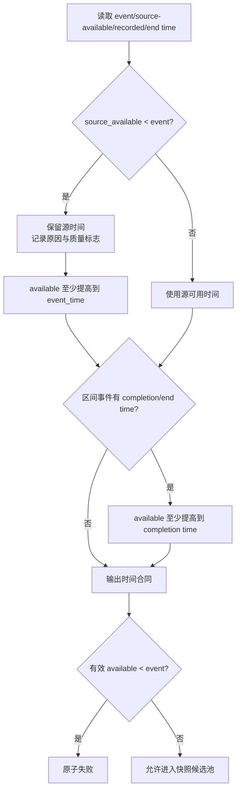
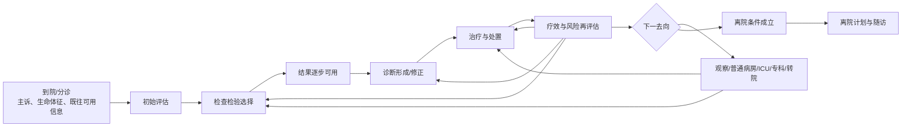
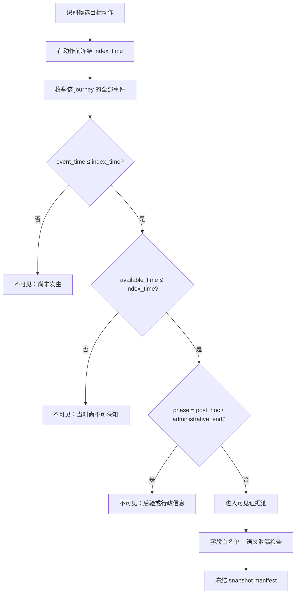
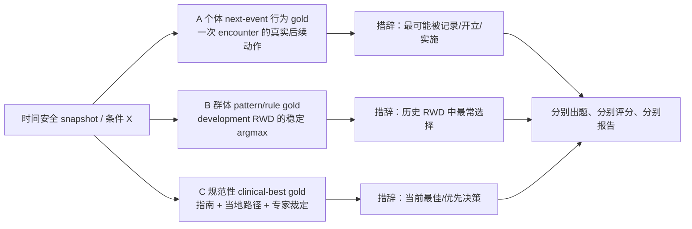
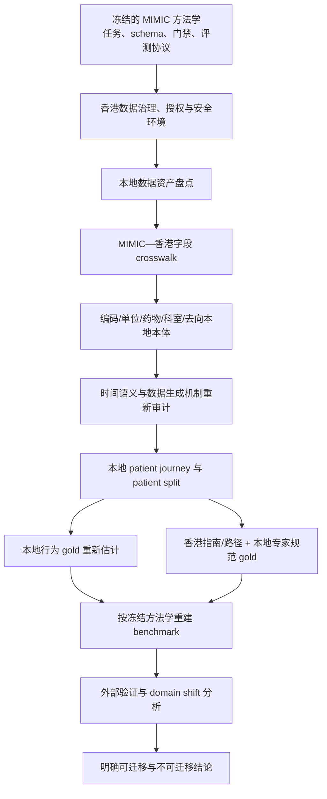

# Patient-Journey Benchmark 详细技术路线图

> 状态快照：2026-08-12
>
> 研究定位：先在 MIMIC 中开发、验证并冻结方法学，再在香港真实世界资料中进行本地适配与外部验证。
>
> 核心问题：模型能否在患者单次就诊的不同临床决策节点，仅依据“当时已经发生且已经可用”的信息，做出检查、诊断、治疗、去向和离院计划决策？

## 1. 状态图例与总体判断

| 状态 | 含义 | 本路线中的判定方式 |
|---|---|---|
| **已完成** | 代码、正式产物和验收证据均存在 | 以已提交代码、正式 manifest、metrics 和独立审计为准 |
| **当前进行中** | 已有候选实现或候选产物，但尚未完成复现、冻结或正式发布 | 不写成完成，不允许下游把候选当正式输入 |
| **待实施** | 仅有原则、设计或局部代码 | 必须先补可执行协议、产物合同和验收门禁 |
| **香港验证** | MIMIC 方法学冻结后才启动 | 不直接搬运 MIMIC 字段、阈值、gold 或医院流程 |

当前主线结论：

1. MIMIC 冠状动脉疾病谱原始归档及全量 EDA 已完成。
2. 33 张输入表的封闭来源合同、21 张事实源事件化和 100 例 cleaned events 独立验收已完成。
3. 100 例确定性标准化已正式发布并通过双批量复现与独立验收：66,652 条事件、3,895 条映射记录和 1,001 条人工审核队列均已进入正式产物。
4. 当前有两个汇合中的工作门禁：数据支路生成首批文本证据输入清单；评测主线冻结研究构念及首个检查决策协议。Patient journey、决策快照、gold、MCQ 和 LLM 评测尚未实现。
5. 香港真实世界资料只用于冻结方法学后的外部验证；MIMIC 结果不能直接代表香港临床实践。

## 2. 全局技术路线

```mermaid
flowchart LR
    R0["R0 研究构念与首任务协议<br/>当前设计门禁"] --> D0["D0 MIMIC 数据版本与源表合同<br/>已完成"]
    D0 --> D1["D1 单次住院原始归档<br/>已完成"]
    D1 --> D2["D2 字典解码与 POE timeline<br/>已完成"]
    D2 --> D3["D3 临床事件清洗<br/>100例已验收"]
    D3 --> D4["D4 确定性标准化<br/>100例已验收"]
    D4 --> D5["D5 首批文本证据输入清单<br/>当前数据支路"]
    D4 --> J0["J0 Patient journey 事件流<br/>待实施"]
    D5 --> J0
    J0 --> S0["S0 决策节点检测与时间安全快照<br/>待实施"]
    S0 --> G0["G0 行为/群体/规范 gold<br/>待实施"]
    G0 --> Q0["Q0 五类 MCQ 与临床审核<br/>待实施"]
    Q0 --> E0["E0 LLM 与临床参照评测<br/>待实施"]
    E0 --> H0["H0 香港 RWD 本地适配<br/>外部验证"]
    H0 --> H1["H1 跨地区效度与 domain shift<br/>外部验证"]

    classDef done fill:#d8f3e6,stroke:#0072B2,stroke-width:2px,color:#102a43;
    classDef current fill:#fff0c2,stroke:#D55E00,stroke-width:4px,color:#3d2c00;
    classDef pending fill:#eef2f7,stroke:#66788a,stroke-width:2px,stroke-dasharray:6 4,color:#263746;
    classDef hk fill:#eadcf8,stroke:#CC79A7,stroke-width:3px,stroke-dasharray:3 3,color:#35213f;
    class D0,D1,D2,D3,D4 done;
    class R0,D5 current;
    class J0,S0,G0,Q0,E0 pending;
    class H0,H1 hk;
```



### 2.1 两层研究结构

| 层 | 解决的问题 | 结束标志 |
|---|---|---|
| 数据层 | 从分散 EHR 源表构建不重不漏、时间安全、可追溯的患者单次就诊证据 | normalized event 与文书证据可以按患者、就诊、事件、可用时间和来源稳定回查 |
| 评测层 | 将证据冻结为决策快照，构建不同构念的 gold，生成题目并评估模型 | 每道题都有 snapshot、gold、来源、泄漏报告、审核记录和评测结果 |

## 3. R0：研究构念、范围与治理

### 3.1 输入

- 目标场景：患者一次急诊或住院就诊中的完整临床旅程。
- 目标能力：检查检验选择、临床诊断、治疗与处置、去向与专科选择、离院计划与随访。
- 开发数据：MIMIC-IV v3.1、MIMIC-IV-ED 2.2、MIMIC-IV-Note 2.2。
- 外部验证数据：香港真实世界资料，具体数据资产和授权范围尚待盘点。

### 3.2 必须冻结的定义

| 定义项 | 需要回答的问题 | 冻结产物 |
|---|---|---|
| journey 边界 | 一次住院是否包含入院前 ED？独立 ED 如何处理？既往就诊信息窗口多长？ | `journey_scope_spec` |
| 决策节点 | 什么事件代表“决策即将发生”？多个并行动作如何处理？ | `decision_node_spec` |
| 可见证据 | event time、available time、文书阶段和未知信息如何处理？ | `snapshot_policy` |
| 任务构念 | 测历史行为、群体模式，还是临床最佳决策？ | `task_construct_registry` |
| gold 来源 | 实际事件、群体规则、指南和专家分别扮演什么角色？ | `gold_source_policy` |
| 数据划分 | development、validation、final test 在何时冻结？ | `subject_split_manifest` |
| 发布声明 | MIMIC 结论能声称什么，不能声称什么？ | `claim_boundary` |

### 3.3 验收与停止条件

- 五类任务均有唯一任务名称、目标事件本体和 index-time 定义。
- 行为一致性和规范性决策不能共享一个未标注的 gold。
- 同一患者所有就诊只能进入一个 split。
- 未解决 journey 边界或目标动作定义时，停止生成快照和题目。

**当前状态：待冻结。** 已形成原则，但尚无统一、机器可执行的全局注册表。

## 4. D0：MIMIC 数据输入与源表合同

### 4.1 数据输入

| 数据包 | 主要内容 | 在 patient journey 中的作用 |
|---|---|---|
| MIMIC-IV HOSP | 住院、检验、医嘱、药房、处方、给药、诊断、操作、服务和转移 | 住院主干、检查、治疗、诊断编码、去向候选 |
| MIMIC-IV ICU | ICU stay、输入、输出、操作及其组成 | 严重病例的治疗、监测结果和 ICU 流程 |
| MIMIC-IV-ED | ED stay、分诊、生命体征、诊断、药物核对和 Pyxis | 到院信息、早期评估和急诊处置 |
| MIMIC-IV-Note | 放射报告、出院小结及 detail | 结果文书、后验标签和离院计划候选 |

### 4.2 处理

1. 锁定数据版本和文件完整性。
2. 锁定表头、字段类型、主键、外键和允许的父子关系。
3. 区分住院内源表、外置公共字典和明确排除表。
4. 禁止通过时间邻近猜测没有原生关系的连接。
5. 将患者级原始数据限制在 Git 忽略的数据目录。

### 4.3 产物与门禁

- 32 张住院内源表进入 raw admission archive。
- 7 张公共字典独立保存。
- `icu.chartevents` 按当前研究范围排除；`omr` 因无可靠原生住院连接排除。
- 未知表、未知字段、主键冲突或 schema 漂移均原子失败。

**当前状态：已完成。**

## 5. D1：队列选择、患者隔离与单次住院原始归档

### 5.1 队列与划分

```text
全体可关联住院
  → 疾病谱候选选择
  → 冠状动脉疾病谱：ICD-9 410–414 / ICD-10 I20–I25
  → 按 subject_id 固定患者分区
  → development / validation / final-test 互斥
```

要求：队列标签不写回原始临床记录；同一患者不能跨 split；工程审计样本不能冒充盲法 final test。

### 5.2 原始归档处理链


### 5.3 不做的事情

- 不删除、覆盖或重命名原始字段。
- 不把结果聚合成无法回查的摘要。
- 不在 raw 层构造标准概念、专科标签、决策快照或 gold。
- 不把 `chartevents` 偷偷加入当前队列。

### 5.4 当前正式证据

| 指标 | 当前值 |
|---|---:|
| 冠状动脉疾病谱住院 | 108,833 |
| 唯一患者 | 46,062 |
| JSONL 体积 | 50.392 GiB |
| 分片 | 218 |
| schema 非法记录 | 0 |
| 患者分区冲突 | 0 |
| 禁止的 `chartevents` | 0 |

**当前状态：已完成。**

## 6. D2：字典解码与 POE 医嘱生命周期

### 6.1 字典解码

| 输入编码 | 复合键或约束 | 输出 |
|---|---|---|
| 检验 `itemid` | `d_labitems.itemid` | 原编码 + 解码名称、类别、标本 |
| ICU `itemid` | `d_items.itemid` 且 `linksto` 与事件表一致 | 原编码 + 项目名称和单位 |
| ICD 诊断/操作 | `(icd_code, icd_version)` | 原编码 + 官方标题 |
| HCPCS | 官方 code | 原编码 + 描述 |

### 6.2 POE 与药物连接

```text
poe + poe_detail
  → poe_id + poe_seq
  → create / change / discontinue 等事务序列
  → poe_timeline

prescription ↔ POE：poe_id + poe_seq
prescription ↔ pharmacy：pharmacy_id
eMAR ↔ pharmacy：pharmacy_id
eMAR ↔ detail：subject_id + emar_id + emar_seq
```

### 6.3 语义边界

- POE 表示医嘱意图，不表示已经执行。
- prescription、pharmacy、eMAR、ICU input 和 procedure 是不同事实层。
- 多候选连接保留歧义，不用药名相似度、时间邻近或 LLM 强行补链。
- stop/change 事务区分本次事务内容与被作用的前序内容。

### 6.4 验收

- 原始字段可逆恢复。
- 所有 supporting reference 可回到同一患者、同一次住院的源行。
- 冲突和未解析连接有稳定 reason code。

**当前状态：已完成。**

## 7. D3：33 表临床事件清洗

### 7.1 来源角色

| 角色 | 数量 | 明细 |
|---|---:|---|
| 事实源 | 21 | ED 5张；HOSP 11张；ICU 3张；Note 2张文档元数据 |
| support | 6 | `poe`、`poe_detail`、`emar_detail`、`ingredientevents`、两张 note detail |
| context | 6 | `patients`、`admissions`、`drgcodes`、`icustays`、`datetimeevents`、`edstays` |

### 7.2 源行到事件

```text
原始源行
  → 生成稳定 source_row_id
  → 按源表 transformer 解释语义
  → 一行拆成一个或多个原子事件
  → 生成稳定 event_id
  → 建立 supporting lineage
  → accepted 或 rejected
  → 逐表验证 input = accepted + rejected
```

### 7.3 时间合同

| 字段 | 含义 | 下游用途 |
|---|---|---|
| `event_time` | 事件发生、开始或临床标记时间 | 判断事件是否已经发生 |
| `source_available_time` | 源系统原始存储/记录时间 | 保留源端事实和异常 |
| `recorded_time` | 系统录入、核验或存储时间 | 审计记录过程 |
| `available_time` | 经保守下界修正后，下游可使用的最早时间 | 防止未来信息泄漏 |



### 7.4 100 例正式验收

| 指标 | 当前值 |
|---|---:|
| 输入事实源行 | 65,811 |
| accepted 事件 | 66,652 |
| rejected 源行 | 43 |
| term inventory | 3,895 |
| cleaned SHA-256 | `bda93a98cf50f8de8961d7c6883e2e401f0c38618c83c08d7074fef5072997bb` |
| 独立审计阻断项 | 0 |

**当前状态：100 例已完成独立验收。** 这不等于全队列清洗已经完成。

## 8. D4：确定性标准化（100 例已完成）

### 8.1 输入

- 66,652 条新版 cleaned events。
- 3,895 条 term inventory。
- 冻结的 ICD、HCPCS、MIMIC 字典、药物原生编码、审核同义词和单位别名。

### 8.2 转换规则

```text
term inventory
  → source code 是否有效
  → 冻结字典/审核规则匹配
  → mapped / unresolved / not_applicable
  → 单位独立映射
  → normalization_mappings
  → normalized_events
  → normalization_review_queue
  → normalization_manifest
```

约束：

- 不调用 LLM 猜测同义词或多候选映射。
- 无效 NDC/GSN 等代码不能因为“非空”就自动标记 mapped。
- 原始 code、label、value、unit 和 lineage 不得丢失。
- normalized events 必须与 cleaned events 保持事件数和 event-id 序列一致。
- manifest 必须绑定 cleaned SHA-256、term inventory SHA-256、映射版本和全部输出哈希。

### 8.3 正式验收状态

| 项目 | 正式值 | 验收解释 |
|---|---:|---|
| normalized events | 66,652 | 与 cleaned events 数量及 event-id 序列一致 |
| normalization mappings | 3,895 | 与 term inventory 一一对账 |
| review queue | 1,001 | 作为显式人工审核队列保留，不做静默猜测 |
| 映射版本 | `event-terminology/1.1.0` | 已写入正式 run manifest |
| 术语状态 | mapped 36,755；unresolved 29,897 | mapped 表示确定性规则成功，不等同于全部映射到统一外部本体 |
| 单位状态 | mapped 25,490；not applicable 40,849；unresolved 313 | 单位映射与术语映射独立报告 |
| 可重复性 | batch size 5,000 与 777 的三份 Parquet 哈希一致 | run id、数量和状态分布同时一致 |
| 独立验收 | `can_publish_normalization=true`；阻断项 0 | 允许正式发布，也允许开始准备文本 NER 输入 |

### 8.4 已通过的完成门禁

1. 相同输入和映射版本复跑，四个正式产物字节哈希一致。
2. 独立审计确认事件序列、原始字段、映射应用和 manifest 全部一致。
3. 1,001 条 review queue 按原因、实体类型、事件覆盖和下游影响完成画像。
4. 无效源编码、未知单位和多候选术语没有被静默映射。
5. 产物原子发布为正式 `normalization` 目录。
6. 代码、测试、审计脚本和正式报告形成一个完整 Git commit。

**当前状态：100 例已完成并提交。** 这证明标准化流水线可复现，不代表全队列标准化已经完成；`unresolved` 也不等于数据错误，而是明确留待字典、原生编码或人工审核处理。

## 9. D5：临床文书索引、章节与选择性 NER（当前数据支路）

### 9.1 为什么独立成支路

放射报告和出院小结是同一次 admission 内的多份文档，而不是一个可直接清洗的字符串。结构化事件可以先支持部分 patient-journey 任务；文书支路为症状、影像结论、诊断理由和离院计划补充可追溯文本证据。

### 9.2 三层产物

| 层 | 处理 | 产物 |
|---|---|---|
| 文档层 | `note_id`、文档类型、chart/store time、文本哈希、来源 | `note_index.parquet` |
| 章节层 | 放射/出院模板分开解析，保留 span 和章节标题 | `note_sections.parquet` |
| 事实层 | assertion、temporality、experiencer、实体、关系和标准化状态 | `entity_mentions.parquet`、`clinical_events.parquet`、`relations.parquet` |

### 9.3 约束与门禁

- 原始文书不修改。
- 文本事实必须回到 `note_id + section_id + span`。
- negated、historical、family experiencer 不得删除或误当患者当前阳性事实。
- 出院小结固定为 `post_hoc`，不能进入前四类前瞻题干。
- 未经明确合规审查，不向普通外部模型 API 发送患者级文本。
- 先做约 200 份分层文档 pilot 和双人审核，再扩容。

**当前状态：输入清单待生成。** 首批只纳入 ED chief complaint 和按文档/章节拆分的放射报告；出院小结保留为 `post_hoc`，不进入首批 NER；结构化标准化中的 unresolved 继续走字典、原生编码或人工审核，不送入文本 NER。当前门禁只授权生成输入清单，不授权调用任何外部模型。

## 10. J0：Patient journey 事件流

### 10.1 journey 不是刚性直线



### 10.2 journey 数据模型

| 对象 | 必要字段 | 作用 |
|---|---|---|
| Journey | `journey_id`, `subject_id`, encounter refs, start/end, split | 单次就诊边界 |
| Event | `event_id`, event kind, event/available time, phase, source refs | 时间化事实 |
| State | location、service、active problems、ongoing treatment、unknowns | 某一时点患者状态 |
| Decision node | node type、index time、target window、eligibility | 候选评测切片 |
| Evidence edge | event → node 的可见/不可见原因 | 泄漏和来源审计 |

### 10.3 处理

1. 按患者和就诊确定 journey 边界。
2. 以 `event_time` 排临床发生顺序，以 `available_time` 控制信息何时可见。
3. 将位置、负责服务、医嘱、处方、给药和实际操作保留为不同状态。
4. 建立循环和条件分支，不强迫每位患者经过五个节点。
5. 对缺失、冲突和未知状态显式编码，不把空数组解释为“患者没有该临床情况”。

### 10.4 验收

- 每个事件恰好属于一个 journey 或进入 unresolved 队列。
- journey 内时间排序稳定；同时间事件保留并列关系。
- 不因构建 journey 改写 event 或 available time。
- 可从 journey → node → evidence → raw row 反向追溯。

**当前状态：待实施。**

## 11. S0：决策节点检测与时间安全快照

### 11.1 通用冻结逻辑



### 11.2 快照内容

- 人口学背景和当时允许使用的既往信息。
- 当前主诉、症状、生命体征。
- 已开立检查和当时已经返回的结果。
- 当时已经形成的诊断证据，而非出院 ICD 反填。
- 已发生治疗、当前医嘱/处方/给药/操作状态。
- 当前负责服务和物理位置，二者分开。
- 未知、缺失、冲突及其原因。
- 每条证据的 event ID、source row、event time、available time 和 phase。

### 11.3 三层泄漏门禁

| 泄漏层 | 自动检查 | 人工检查 |
|---|---|---|
| 时间 | event/available time、phase、target window | 时间语义是否符合真实工作流 |
| 语义 | gold、同义词、计划词、最终诊断、出院章节黑名单 | 是否存在隐含但等价的答案提示 |
| 身份/划分 | subject split、模板哈希、近重复 | 病例是否可由罕见组合重建 |

**当前状态：待实施。** 通用原则已明确，但缺少机器可执行的 snapshot builder 和 manifest schema。

## 12. 五类决策节点的完整任务合同

### 12.1 检查检验选择

| 项目 | 具体定义 |
|---|---|
| 决策单元 | 单项检查、同一目的的检查组合，或冻结 comparison class 中的一个候选 |
| index time | 目标检查医嘱创建前；群体规则题则使用冻结的标准化条件 X |
| 可见证据 | 症状、生命体征、既往可用结果、当时诊断假设、已开但未返回的检查状态 |
| 禁止证据 | 目标检查结果、后续诊断/治疗、放射报告全文、出院小结和后验编码 |
| 个体行为 gold | target window 内实际开立且状态有效的检查事件 |
| 群体规则 gold | development 患者中 `argmax P(y|X)`，通过 validation 稳定性门禁 |
| 规范 gold | 指南/当地路径 + 双专家独立裁定；不由 MIMIC 实际行为自动证明 |
| 主要门禁 | comparison class 冻结、唯一答案、无并列动作、FDR/支持度/稳定性、无未来信息 |
| 当前状态 | 设计最成熟，但尚无基于新版事件层的正式 snapshot/rule 产物 |

### 12.2 临床诊断

| 项目 | 具体定义 |
|---|---|
| 决策单元 | 某一诊断形成或修正时点的单一最佳诊断/鉴别结论 |
| index time | 诊断记录或关键治疗动作前，且必要结果已经可用 |
| 可见证据 | 症状、体征、已经返回的检验/影像、当时病史和治疗反应 |
| 禁止证据 | 出院 ICD、DRG、出院小结“最终诊断”、诊断后的特异治疗和后续结局 |
| 行为 gold | 明确时间化的诊断记录；出院 ICD 仅作候选筛选或后验对照 |
| 规范 gold | 指南证据包 + 两名专家独立作答 + 第三人裁决 |
| 干扰项 | 同器官系统、相似表型、相同诊断层级的鉴别诊断 |
| 主要门禁 | 信息足够、唯一最佳、诊断粒度一致、无标签反填 |
| 当前状态 | 题型规范存在；可执行 gold 和审核流程未实现 |

### 12.3 治疗与处置

| 项目 | 具体定义 |
|---|---|
| 决策单元 | 药物、操作或管理动作中的一个明确目标；不能把所有治疗打包为一个答案 |
| index time | 目标治疗医嘱/处方/执行前，适应证、严重度和禁忌证信息已可用 |
| 可见证据 | 当前诊断证据、生命体征、肾肝功能、过敏、既往治疗和治疗反应 |
| 禁止证据 | 目标治疗后的反应、后续给药记录、出院总结和结局反推 |
| 行为 gold | 必须明确选择 POE、prescription、eMAR、input 或 procedure 中哪一层 |
| 规范 gold | 指南 + 剂量/途径/时机 + 禁忌证 + 专家裁定 |
| 干扰项 | 同适应证附近、但因时机、禁忌、强度、剂量或途径不当的方案 |
| 主要门禁 | 目标事件层冻结；患者偏好或关键禁忌缺失则拒题 |
| 当前状态 | 题型规范存在；目标事件本体和规范 gold 未冻结 |

### 12.4 去向与专科选择

| 项目 | 具体定义 |
|---|---|
| 子任务 | 紧急分流、专科会诊、负责服务、物理病区、院外转介/离院去向必须分开 |
| index time | 会诊、收治、转运或去向决定前，关键诊断和严重度证据已可用 |
| 可见证据 | 病情、资源需求、当前服务/位置、治疗反应、需要的专科能力 |
| 禁止证据 | 实际后续床位、转科完成记录、出院结局和组织资源导致的事后去向 |
| 行为 gold | 与子任务一致的 consult、service、transfer 或 disposition 事件 |
| 规范 gold | 专科能力、紧急程度和当地服务目录/转诊路径共同决定 |
| 干扰项 | 同一服务层级的相邻专科或处置路径 |
| 主要门禁 | 不用物理位置替代负责专科；床位限制导致的非理想路径不能自动成为规范 gold |
| 当前状态 | MIMIC 可开发任务结构；香港服务目录未建立前不能冻结香港规范 gold |

### 12.5 离院计划与随访

| 项目 | 具体定义 |
|---|---|
| 子任务 | 用药延续、复查/复诊、自我监测、活动/饮食、伤口护理、危险信号单题单目标 |
| index time | 病情稳定且离院条件成立，但正式出院指导文本尚不可见 |
| 可见证据 | 最终诊断、关键治疗、治疗反应、离院状态、必要社会和功能因素 |
| 禁止证据 | 将出院指导原文直接放入题干；用事后再入院结局反推答案 |
| 行为 gold | 实际出院指导适合文书内容预测，不自动代表最佳随访 |
| 规范 gold | 疾病/操作指南、药物安全要求、当地随访路径和专家裁定 |
| 干扰项 | 同一管理目标但频率、时间、阈值、持续时间或安全性错误的建议 |
| 主要门禁 | 模板化、无患者特异性、离院稳定性不明或多个建议打包时拒题 |
| 当前状态 | 数据源和题型规范存在；前瞻快照、单目标标签和本地路径未实现 |

## 13. G0：三条 gold 轨道必须分离



### 13.1 每个 gold 的最小字段

- `gold_id`、`task_id`、`construct_type`。
- `snapshot_id` 或 `rule_manifest_id`。
- target ontology、候选集合和唯一答案。
- 证据来源、target window、支持度和不确定性。
- 行为事件 refs，或指南版本/页码/条款。
- 两名专家独立答案、置信度、分歧原因和裁决结果。
- 状态：candidate / validated / failed / inconclusive / released。

### 13.2 规范性裁定

1. 方法学人员冻结快照、问题和候选项。
2. 两名场景相关专家独立判断，不先看实际 EHR 行为。
3. 一致则进入审核；不一致由第三名资深专家裁决。
4. 若分歧源于缺信息或确有两个合理答案，修改或删除题目，不能用多数票掩盖歧义。

**当前状态：待实施。**

## 14. Q0：MCQ 生成、自动门禁与临床审核

### 14.1 生成链

```text
冻结 snapshot / rule + 唯一 gold
  → 生成最小充分题干
  → 固定正确答案内容
  → 同任务本体召回 6–10 个干扰候选
  → 选择 3 个不同错误机制的功能性干扰项
  → 确定性平衡 A–D 位置
  → 自动审计
  → 双专家独立审核
  → accept / revise-and-rereview / reject
  → release manifest
```

### 14.2 自动门禁

- schema 完整且恰好一个 gold。
- snapshot 或 rule manifest 可追溯。
- 四个选项唯一、同粒度、非同义、无包含关系。
- 无时间、语义、身份、模板和 split 泄漏。
- 不复制患者原文，不含占位符、内部 ID 或精确日期。
- 行为题和规范题使用与构念一致的措辞。
- 24 种答案排列抽样检查内容一致性。
- 任一生成、审核或来源信息缺失均 fail closed。

### 14.3 pilot

- 每个维度先生成 150–200 个证据候选，形成约 100 道候选题。
- 记录从 source → snapshot/rule → gold → generated → reviewed → released 的完整漏斗。
- 首个 pilot 建议先做检查题 pattern/rule-concordance，再做诊断规范题。

**当前状态：设计阶段，尚无新版数据层上的端到端实现。**

## 15. E0：LLM 与临床参照评测

### 15.1 冻结项

- 模型、供应商、版本、调用日期和参数。
- zero-shot / few-shot 提示模板和示例来源。
- 输出 schema、拒答政策和解析失败政策。
- 主指标、次指标、统计检验和亚组分析。

### 15.2 指标

| 层级 | 指标 |
|---|---|
| 单题 | accuracy、拒答、解析失败、置信度/校准、严重错误等级 |
| 决策节点 | 五类任务分别报告准确率和患者聚类 bootstrap 95% CI |
| journey | 节点覆盖率、整条旅程完成率、跨节点一致性、错误传播 |
| 稳健性 | 题干改写、去除非决定信息、答案重排和重复运行的一致性 |
| 人类参照 | 专科专家、普通临床医生、低年资医生分层表现 |
| 亚组 | 疾病、急缓程度、场景、年龄、性别和病例难度 |

### 15.3 跨节点一致性

模型可能单题得分尚可，但旅程内部矛盾。例如诊断选择 A，治疗仅适用于 B，去向又与 A/B 均不一致。评测必须保存每个 journey 的节点序列，检测：

- 诊断—治疗一致性；
- 严重程度—去向一致性；
- 治疗反应—离院计划一致性；
- 前一节点的明确判断是否被后续无证据地反转。

**当前状态：待实施。**

## 16. H0–H1：香港真实世界资料适配与外部验证

### 16.1 不是“替换数据源”



### 16.2 必须重新完成的工作

| 工作 | 为什么不能照搬 MIMIC |
|---|---|
| 字段 crosswalk | EHR 系统、字段粒度和文书结构不同 |
| 时间语义 | 下单、采集、验证、发布和医生可见时间可能不同 |
| 编码与单位 | ICD 版本、药物字典、检验编码和单位体系不同 |
| 科室/去向本体 | 美国单中心服务结构不能代表香港转诊路径 |
| 行为 gold | 真实实践频率和资源约束不同，必须本地重估 |
| 规范 gold | 需香港指南、本地临床路径和专家重新裁定 |
| 阈值 | 支持度、覆盖率、缺失模式和候选空间必须重估 |
| 评测解释 | domain shift 下的性能下降不能简单归因于模型能力 |

### 16.3 外部验证输出

- MIMIC 与香港患者结构、疾病谱、场景和缺失模式比较。
- 五类节点的覆盖率和可构建率比较。
- 同一模型在两地的节点级和 journey 级性能比较。
- 行为 gold 的一致与分歧、规范 gold 的一致与分歧。
- 字段、规则、阈值、路径和模型表现的 domain-shift 归因。
- 明确哪些结论具有跨地区效度，哪些仅适用于单一数据库或医疗系统。

**当前状态：香港验证阶段，尚未启动。**

## 17. 里程碑、交付物和停止条件

| 里程碑 | 状态 | 输入 | 必须交付 | 通过条件 | 停止条件 |
|---|---|---|---|---|---|
| M0 构念冻结 | 当前设计门禁 | 研究目标、五类任务 | task/construct/snapshot/gold 注册表 | 定义唯一、可执行、无混轨 | 任务目标或 gold 含义仍歧义 |
| M1 MIMIC raw 底座 | 已完成 | MIMIC 三数据包 | raw JSONL、manifest、EDA、字段合同 | schema/主键/分片/患者隔离通过 | 未知字段、父子键冲突、分区冲突 |
| M2 cleaned event | 已完成100例 | 解码 admission JSONL | cleaned/rejected/inventory/reconciliation/manifest | 66,652事件独立审计无阻断 | 来源、身份、时间或哈希不一致 |
| M3 normalized event | 100例已完成 | cleaned + inventory | normalized/mappings/review/manifest/audit | 双批量复跑哈希一致、独立审计通过 | 静默映射、事件丢失、产物不可复现 |
| M4 journey + snapshot | 待实施 | normalized + 文书事实 | journey、node、snapshot、leakage report | 全部证据时间安全且可追溯 | 任一未解释未来信息或 split 泄漏 |
| M5 首任务 pilot | 待实施 | 检查规则/快照 | 约100候选题、审核与测量报告 | gold唯一、专家一致、干扰项有效 | 无唯一答案>10%或任何未解释泄漏 |
| M6 五节点 benchmark | 待实施 | 五类冻结任务 | 五维 release + journey links | 每维独立可靠，跨节点可追踪 | 某维构念/数据不足则不扩容该维 |
| M7 LLM 评测 | 待实施 | release benchmark | 模型、人类和稳健性报告 | 预注册协议完整执行 | 模型/提示/指标中途改动未升版本 |
| M8 香港外部验证 | 香港验证 | 冻结方法学 + 香港 RWD | crosswalk、本地gold、外部验证报告 | 本地重建和 domain-shift 分析完整 | 权限、时间语义或本地路径未解决 |

## 18. 当前执行队列

### 18.1 当前数据支路：生成首批文本证据输入清单

1. 从 100 例 admission 中枚举 ED chief complaint 和放射报告文档，不复制或改写原始文本。
2. 对放射报告生成稳定的 `note_id + section_id + span` 定位；保留 chart/store time、文本哈希和来源。
3. 输出机器可读的 `text_ner_input_manifest`，逐条记录纳入、排除及原因，并汇总患者、就诊、文档和章节数量。
4. 明确排除出院小结和所有 `post_hoc` 内容；结构化 unresolved 不混入文本 NER。
5. 用输入哈希、重复运行一致性、患者隔离和时间字段完整性验收清单，不在本任务中调用模型。

### 18.2 当前评测主线：冻结首个可执行决策协议

建议首个任务仍为检查检验选择的 pattern/rule-concordance，但必须先冻结：

- X 条件生成器和字段白名单；
- 合法检查候选目录与 comparison class；
- development-only 统计、validation 稳定性和 final-test 隔离；
- hypothesis family、FDR、支持度、置信区间和并列政策；
- rule manifest、snapshot/payload、gold 和 MCQ schema；
- 自动门禁、人工审核表和停止条件。

完成条件是形成可执行注册表和 schema，并能让独立实现者从相同 development 数据得到相同候选集合、规则结果和拒题原因；在此之前不生成正式题目。

### 18.3 两条支路汇合：patient journey 最小闭环

选择少量 development 患者，完成：

```text
normalized events
  → journey
  → 一个检查决策节点
  → 时间安全 snapshot 或 rule payload
  → 单一构念 gold
  → MCQ
  → 自动审计
  → 临床审核
  → 小规模模型与人工试答
```

通过该闭环后，再扩展诊断、治疗、离院和去向；不要在首个闭环尚未证明可行前同时开发五条任务线。

## 19. 可审计产物总表

| 阶段 | 机器可读产物 | 人工可读产物 |
|---|---|---|
| raw | shard manifest、schema validation、hashes | raw EDA、字段字典 |
| decode/POE | decoded JSONL、POE metrics | 规则与官方语义证据 |
| clean | cleaned/rejected/inventory/reconciliation/run manifest | 独立验收报告、浏览器 |
| normalize | normalized/mappings/review/run manifest | review画像、独立验收报告 |
| text | note index、sections、mentions、relations | 文书抽样审核报告 |
| journey | journey/event/state/node manifests | journey 可视化审计页 |
| snapshot | snapshot manifest、evidence edges、leakage report | 临床可读病例切片 |
| gold | behavior/rule/normative manifests、adjudication | 专家裁定记录与证据包 |
| MCQ | versioned item JSONL、release manifest | 题目册、审核漏斗和题项分析 |
| evaluation | responses、parsed answers、metrics、bootstrap | 模型/医生比较与错误分析报告 |
| Hong Kong | crosswalk、local ontology、local gold | 外部验证和 domain-shift 报告 |

## 20. 路线图验收清单

- [x] 每个阶段显示输入、处理、产物、门禁和当前状态。
- [x] 五个临床决策节点分别展开。
- [x] 个体行为、群体规则和规范性 gold 全程分离。
- [x] `event_time` 与 `available_time` 同时控制快照可见性。
- [x] patient journey 包含循环和条件分支，不被画成刚性线性流程。
- [x] MIMIC 方法学开发与香港外部验证明确分层。
- [x] 已完成、当前门禁和待实施内容没有混写。
- [x] 当前下一任务落到可执行产物与机械验收条件。
