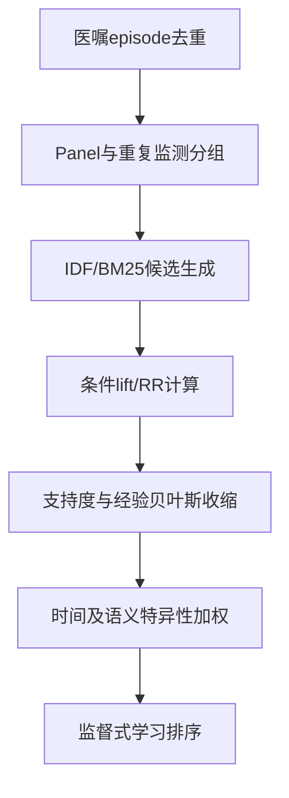

# chatgpt response

可以。检索时应把问题拆成四条证据链：医嘱/代码频率偏倚、逆频率患者表示、目标特异性关联权重、监督式长尾校正。我先按“与问题的直接程度”筛文献，而不把泛泛的检查过度使用研究混进来。

从初步检索看，与你问题完全重合的研究不多，但已有文献形成了几类可迁移的解决方案。检索时需要特别区分：

- 输入端高频医嘱遮蔽：你的核心问题；
- 输出标签长尾不平衡：相关但不是同一个问题；
- 检查过度使用/低信息检查：属于后续临床价值验证。


- 逆频率加权  
    使用 TF-IDF、inverse patient frequency 或 BM 25，降低 CXR、BMP 等普适医嘱在相似度和表示中的权重。适合候选生成和患者相似度。
- 目标特异性加权  
    使用 lift、PMI、relative risk、O/E ratio、specificity 等，评价某医嘱相对背景人群在目标诊断路径中的富集程度。适合关系和规则重排。
- 可靠性收缩  
    给 PMI、RR 等加入最小支持度、置信区间、经验贝叶斯平滑或 reliability，避免极低频偶然共现被错误放大。PSR 属于这一类复合方法。
- 判别式时序模式挖掘  
    不再寻找“最常见路径”，而寻找最能区分目标与对照患者的序列，同时考虑事件顺序、时间间隔、近期性和并发医嘱。
- 监督式权重学习  
    使用正则化回归、学习排序、GBDT、度量学习或半监督学习，根据诊断或专家标签自动学习医嘱权重，并控制医嘱间共线性。
- 长尾表示增强  
    使用 focal/class-balanced loss、知识图谱、代码层级、对比学习和 few-shot learning，增强低频医嘱或代码的表示。主要适用于深度序列模型。


## 一、已有解决方案主要分为六类

### 1. TF-IDF / inverse patient frequency：压低普适事件

这是与你问题最直接的一类。

核心思想是将一个患者或一次住院视为“文档”，医嘱视为“词”：

$$
w_{ic}=TF_{ic}\log\frac{N}{df(c)}
$$

其中 $df(c)$ 是包含医嘱 $c$ 的患者或住院数。CXR、BMP 等在大量患者中出现，因此 IDF 较低；罕见但患者特异的检查获得较高权重。

代表研究：

- [Garcelon et al., 2017：Finding patients using similarity measures in a rare diseases-oriented clinical data warehouse](https://www.sciencedirect.com/science/article/pii/S1532046417301764)：将 TF-IDF 和否定状态用于罕见病患者相似度，报告 TF-IDF 明显改善了相似患者检索。
- [Hassaine et al., 2020：Learning multimorbidity patterns from EHR using NMF](https://ora.ox.ac.uk/objects/uuid%3Aa6fa5061-e053-4bec-ae1c-1720c0170089)：提出 disease frequency–inverse patient frequency，降低常见疾病对聚类的支配，在超过 700 万患者的 EHR 中挖掘多病共存模式。
- [Zhang et al., 2024](https://journals.plos.org/digitalhealth/article?id=10.1371%2Fjournal.pdig.0000606)：直接对诊断和药物医嘱构造 order frequency–inverse patient frequency，用于表示某医嘱对某患者相对于队列的重要性。
- [Wang et al., 2021](https://link.springer.com/article/10.1186/s12911-021-01432-x)：使用信息含量 $-\log P(c)$ 表示罕见疾病共享的相似性，直觉上“共同具有罕见疾病”比“共同具有常见疾病”提供更多相似性信息。

对你最有用的是：

- 用 encounter/patient frequency，不要用事件总次数；
- 同一住院反复 BMP 只为 IDF 计算贡献一次；
- TF 使用 binary 或 $1+\log TF$，避免重复检查再次放大；
- 长短序列差异明显时，可以进一步检索 BM 25。

局限是：IDF 只奖励“稀有”，不保证“与某诊断相关”，所以必须配合支持度、目标关联或监督模型。

---

### 2. lift、PMI、RR、O/E：计算目标特异性富集

这类方法不只是问“医嘱罕见不罕见”，而是问：

> 该医嘱在目标诊断路径中的出现率，相对于背景人群提高了多少？

常见形式：

$$
lift(c,Y)=\frac{P(c\mid Y)}{P(c)}
$$

$$
PMI(c,Y)=\log lift(c,Y)
$$

$$
RR(c,Y)=\frac{P(c\mid Y)}{P(c\mid \neg Y)}
$$

代表研究：

- [Li et al., 2020](https://pubmed.ncbi.nlm.nih.gov/32143785/)：比较条件概率、TF-IDF 和 PSR。PSR 将 probability、specificity 和 reliability 组合，在 10 个疾病上的平均 NDCG@10 分别约为 0.660、0.799 和 0.906。这说明单纯逆频率还不够，需要加入目标特异性与共现可靠性。
- [Multimorbidity trajectory study](https://www.nature.com/articles/s41598-020-73231-9)：使用 observed/expected ratio 和 exclusivity 识别每个聚类的核心疾病，从而减少高血压、血脂异常等高患病率疾病对模式解释的影响。

对应到你的研究：

- 条件概率容易把 BMP/CXR 推到前面；
- lift/PMI 能把“高条件概率但同样高基线概率”的常规医嘱压下去；
- RR 更适合目标组与可比对照组的直接比较；
- 应加入最小支持度或经验贝叶斯收缩，避免极少数偶然共现获得极高 PMI。

需要注意，PMI 是 log-lift；固定目标患病率时，RR 与 lift 也是单调相关的。因此，不宜把裸 RR、裸 lift、裸 PMI 当作三个完全独立的算法。更有意义的比较是：

- 全局背景 vs 临床场景匹配背景；
- 无平滑 vs 平滑；
- 无可靠性约束 vs 有支持度收缩；
- 静态共现 vs 时间门禁后的共现。

---

### 3. 判别式序列模式：不用“最频繁”，而用“最能区分”

传统频繁序列挖掘通常寻找支持度最高的路径，天然容易产生常规诊疗流程。

已有方法开始转向“discriminative and representative patterns”：

- [FuzzyGap, 2019](https://pmc.ncbi.nlm.nih.gov/articles/PMC6568087/)：从 EHR 中提取能够区分慢性心衰患者的序列模式，同时处理就诊间隔差异，并给予近期就诊更高权重。
- [Care Pathway Explorer, 2015](https://perer.org/papers/adamPerer-JBI2015.pdf)：对并发事件进行 clinical event package 处理，利用事件层级减少模式爆炸，并同时显示频繁模式与患者结局的关联。
- [Le et al., 2023](https://dl.acm.org/doi/fullHtml/10.1145/3561825)：直接研究 medical-order sequence variants，将频繁医嘱序列的不同变体与人口学、检验结果和住院史联系起来。
- [GASP, 2021](https://joyceho.github.io/assets/pdf/paper/dong-adbis21.pdf)：针对 EHR 多项目事件和噪声，使用图近似序列挖掘，改善模式恢复率并减少频繁模式爆炸。

这一类提示你可以把规则筛选从：

$$
support(X\rightarrow c)
$$

升级为：

$$
DiscriminativeScore=
f\bigl(
support_Y,\,
support_{\neg Y},\,
temporal\ proximity,\,
stability
\bigr)
$$

也就是先保留一定代表性，再要求该路径能够区分目标与对照人群。

---

### 4. 时间敏感 PMI/嵌入：限制共现窗口

全住院期共现容易把所有常规检查都关联到最终诊断。解决方案是限制时间上下文。

[Xiang et al., 2019](https://link.springer.com/article/10.1186/s12911-019-0766-3) 将 word 2 vec、PPMI-SVD 和 FastText 扩展为时间敏感表示，在约 5000 万患者数据上比较：

- 同一次就诊内的窗口更适合概念相似度；
- 30 天窗口的 word 2 vec 更适合疾病发生预测；
- 时间窗口选择会显著改变学到的临床关系。

对你的 MIMIC 决策点而言，建议比较：

- 同一 order burst；
- 过去 6 小时；
- 过去 24 小时；
- 当前住院截至决策点；
- 距诊断前固定窗口。

这样可以避免一个住院早期常规 BMP 与数天后最终诊断被错误连接。

---

### 5. 监督式患者相似度或排序权重

监督学习不直接假设“稀有就是重要”，而是根据目标结果学习不同事件的条件权重。

- [Wang et al., 2021](https://link.springer.com/article/10.1186/s12911-021-01432-x)：先分别计算人口学、实验室、合并症和影像文本相似度，再利用少量专家标注学习整体患者相似度；仅标注 30 名患者形成的 435 个患者对。
- [Zhang et al., 2024](https://journals.plos.org/digitalhealth/article?id=10.1371%2Fjournal.pdig.0000606)：将 OF-IPF、结局感知聚类、L 1 logistic regression、GBDT/XGBoost 和 SHAP 结合；开发集 AUC 0.87，独立医院验证下降至 0.75，显示监督方法性能较强但存在迁移下降。
- Li 等 PSR 本质上也是一种人工设计的弱监督/专家导向复合排名分数。

适合你的监督目标可以是：

- 是否属于目标诊断/筛查路径；
- 是否为专家确认的路径特异性检查；
- 是否提升未来诊断预测；
- 是否为真实的下一项检查。

但如果目标是“预测医生下一步会开什么”，模型可能只是更准确地模仿既有高频行为。因此更理想的监督标签是“目标路径判别性”或“结果诊断增量”，而不仅是历史开单。

---

### 6. 长尾学习和知识关系迁移

这一组研究主要解决低频输出代码，而非高频输入医嘱遮蔽，但方法可以迁移。

[Chen et al., 2023](https://aclanthology.org/2023.clinicalnlp-1.43/) 指出，MIMIC-III 中最常见 ICD 代码出现 20,053 次，而出现不足 100 次的代码约占 12%。已有方案包括：

- focal loss；
- class-balanced loss；
- label-distribution-aware margin；
- 层级 ICD 关系；
- 代码共现图；
- UMLS/知识图谱信息；
- frequent-to-rare representation transfer；
- few-shot/contrastive learning。

该研究使用代码层级和共现关系强化稀有代码表示。

不过这组文献只能作为“监督模型如何保护低频标签”的补充证据。它不能直接证明 IDF 能解决高频输入医嘱占据相似度的问题。

## 二、频率偏倚本身也有直接证据

[Beaney et al., 2023](https://pmc.ncbi.nlm.nih.gov/articles/PMC10537851/) 分析超过 311 万患者、772 万新发慢性病，发现同一疾病代码的重复频率受到：

- 疾病是否纳入付费激励；
- GP practice；
- 患者社会人口学；
- 日历时间；

显著影响。进入激励体系的疾病年编码率约为 1.03，未进入者为 0.32。

作者建议序列模型考虑：

- 机构/医生分层；
- 日历时间；
- 患者与疾病特征调整；
- 亚组评估；
- 对重复代码进行敏感性分析。

这篇文献可以作为你“事件频率并不等价于临床重要性”的主要依据。

## 三、建议形成的核心文献表

| 文献 | 解决方案 | 与你的直接程度 |
|---|---|---|
| Li 2020 | probability vs TF-IDF vs PSR | 很高：疾病—检查关系排名 |
| Zhang 2024 | order frequency–inverse patient frequency | 很高：直接对医嘱进行 IPF 表示 |
| Beaney 2023 | 识别并调整代码频率偏倚 | 很高：直接证明序列频率受医疗过程影响 |
| Garcelon 2017 | TF-IDF + polarity 的罕见病患者检索 | 高：低频高特异性概念检出 |
| Hassaine 2020 | DF-IPF + NMF | 高：抑制常见事件对表示/聚类的控制 |
| FuzzyGap 2019 | 判别式、时间敏感序列模式 | 高：从频繁路径转向判别路径 |
| Perer 2015 | 并发事件打包、事件层级、结局关联 | 中高：解决医嘱成组和模式爆炸 |
| Le 2023 | medical-order sequence variants | 中高：直接研究医嘱序列 |
| Xiang 2019 | time-sensitive PPMI/embedding | 中高：PMI 与时间窗口 |
| Wang 2021 | 半监督相似度权重 | 中高：学习任务特异性权重 |
| Chen 2023 | 关系增强的稀有代码学习 | 中：解决输出长尾 |

## 四、数据库检索式

不要只使用一个检索式，因为该领域术语不统一。

### 1. 高频输入事件与逆频率

```text
(
  "electronic health record*" OR EHR OR EMR
)
AND
(
  "medical order*" OR "diagnostic order*" OR
  "laboratory order*" OR "procedure order*" OR
  "clinical event*" OR "medical code*"
)
AND
(
  "inverse patient frequency" OR
  "inverse document frequency" OR
  TF-IDF OR BM25 OR
  "frequency bias" OR "code frequency"
)
AND
(
  similarity OR ranking OR retrieval OR
  representation OR sequence OR pathway
)
```

### 2. 特异性关联权重

```text
(
  EHR OR EMR OR "real-world data"
)
AND
(
  "clinical pathway*" OR "care pathway*" OR
  "diagnostic pathway*" OR "medical order sequence*"
)
AND
(
  "association rule*" OR
  "sequential pattern mining" OR
  "discriminative pattern*"
)
AND
(
  lift OR PMI OR "pointwise mutual information" OR
  "relative risk" OR "odds ratio" OR
  specificity OR selectivity OR enrichment
)
```

### 3. 低频事件/长尾表示

```text
(
  EHR OR EMR
)
AND
(
  "rare code*" OR "rare event*" OR
  "long-tail" OR "few-shot"
)
AND
(
  diagnosis OR procedure OR laboratory OR
  "clinical event*" OR pathway
)
AND
(
  "class-balanced" OR "focal loss" OR
  contrastive OR hierarchy OR
  "supervised similarity" OR
  "metric learning"
)
```

### 4. 医疗观察过程偏倚

```text
(
  EHR OR EMR
)
AND
(
  "informative presence" OR
  "informative observation" OR
  "observation process" OR
  "measurement process" OR
  "healthcare process bias"
)
AND
(
  order* OR test* OR laboratory OR
  "code frequency" OR sequence
)
```

## 五、建议的检索边界

纳入：

- 真实 EHR、EMR 或 claims；
- 使用结构化医嘱、检查、程序、诊断代码；
- 涉及患者相似度、序列挖掘、路径发现或关系排名；
- 明确处理常见/稀有事件、背景频率或目标判别性；
- 有消融、外部验证、人工评价或低频分层评价。

排除或单独归类：

- 纯文本关键词 TF-IDF；
- 只处理阳性/阴性类别不平衡；
- 只预测下一医嘱但不评价特异性；
- 只研究检查过度使用；
- 只报告整体 AUROC，不报告低频事件性能；
- 只以 attention weight 作为重要性证据。

总体判断是：文献已经分别提供了 IPF、lift/PSR、判别式序列模式、时间敏感 PMI、监督相似度和长尾学习等组件，但尚未形成一个专门针对“高频常规医嘱遮蔽低频诊断性检查”的统一框架。这正好可以成为你的方法学整合点。


# chatgpt response

明白。你的研究前提可以直接设定为：

> 高频常规医嘱会干扰诊断路径识别。研究目标不是再次证明这种现象，而是比较并构建能够消除这种干扰的解决方案。

从现有文献看，可用方案应归纳为六类，其中前三类最适合你的项目。

## 1. 全局逆频率校正：解决“常见医嘱权重过大”

代表方法：

- binary TF；
- log-TF；
- TF-IDF/IPF；
- BM 25。

基本权重：

$$
IDF(c)=\log\frac{N+1}{df(c)+1}
$$

关键不是医嘱总出现次数，而是包含该医嘱的患者、住院或决策点数量。重复 5 次 BMP 不能贡献 5 次全局频率。

文献应用包括：

- Garcelon 等用 TF-IDF 进行罕见病患者检索；
- Hassaine 等用 DF-IPF 降低常见疾病对聚类的支配；
- Zhang 等直接对诊断和药物医嘱使用 OF-IPF；
- Noll 等最新研究中，TF-IDF 在罕见病相似病例 Top-10 检索中取得 91%的平均阳性预测值。[Noll et al.](https://academic.oup.com/jamia/article/33/1/98/8165644)

适合你的环节：

- 患者/住院相似度；
- 路径候选生成；
- 序列模型输入权重；
- 高频医嘱重复抑制。

但 IDF 只解决“普遍性”，不能保证稀有检查确实与目标诊断相关。

## 2. 目标特异性加权：解决“稀有但无关的医嘱被放大”

代表方法：

- lift；
- PMI；
- relative risk；
- odds ratio；
- observed/expected ratio；
- selectivity。

核心是比较目标路径和可比背景人群：

$$
S_{\text{lift}}(c,Y)
=
\log
\frac{P(c\mid Y)}
{P(c\mid B_Y)}
$$

其中 $B_Y$ 不应是全院所有患者，而应是同科室、同住院阶段、相似严重程度和相似诊断风险的背景患者。

例如：

| 医嘱 | 目标路径概率 | 背景概率 | 解释 |
|---|---:|---:|---|
| BMP | 0.85 | 0.80 | 高频但几乎没有目标特异性 |
| D-dimer | 0.20 | 0.04 | 低频但明显富集 |
| 特殊抗体 | 0.03 | 0.001 | 高特异性，但需检查可靠性 |

这类权重适合：

- 疾病—检查关系边；
- 候选医嘱重排；
- 诊断路径特征选择；
- MCQ Gold 检查筛选。

由于 PMI 会过度奖励极少数共现，不能直接使用裸 PMI。

## 3. 特异性＋可靠性收缩：目前最适合你的核心方法

这是 Li 等 PSR 方法提供的最重要思路：不能只看概率或 TF-IDF，而要联合考虑：

- probability；
- specificity；
- reliability。

[Li et al., 2020](https://pubmed.ncbi.nlm.nih.gov/32143785/) 的 PSR 在关系排序中优于单纯概率和 TF-IDF。

你可以将其实现为：

$$
S_{\text{assoc}}(c,Y)
=
\log
\frac{\tilde P(c\mid Y)}
{\tilde P(c\mid B_Y)}
\times
\frac{n_{cY}}{n_{cY}+\tau}
$$

其中：

- $\tilde P$：经过 Beta-Binomial 或 Laplace 平滑的概率；
- $n_{cY}$：目标路径中的支持病例数；
- $\tau$：收缩强度；
- $n/(n+\tau)$：可靠性项。

也可以使用：

- 经验贝叶斯后验均值；
- log-RR 下置信界；
- log-odds with informative Dirichlet prior；
- 最小支持度＋PMI；
- bootstrap 稳定选择。

对你的问题，这通常比裸 IDF 或裸 PMI 更合理：

- BMP 因背景概率高而被压低；
- 只出现 1 次的极罕见检查因可靠性不足而被压低；
- 多次稳定出现在目标路径、但全局频率低的检查被保留。

## 4. 医学语义/本体加权：解决“稀有不等于相关”

2025 年的研究进一步表明，纯 IDF 不一定总能改善患者相似度。Lambert 等比较了普通余弦、IDF 余弦和医学分类关系加权，发现基于药物层级和信息含量的语义权重优于单纯频率权重，而 IDF 在普通药物聚类中没有明显增益。[Lambert et al., 2025](https://link.springer.com/article/10.1186/s12874-025-02459-8)

因此可以加入：

- LOINC 检查层级；
- panel—component 关系；
- SNOMED CT/UMLS 关系；
- 疾病—检查知识图谱；
- ICD 诊断层级；
- 检查的适应证和专科归属。

例如：

$$
S_{\text{semantic}}(c,Y)
=
IC(c)+Similarity_{\text{ontology}}(c,Y)
$$

其中 $IC(c)=-\log P(c)$，但同时利用检查与目标疾病在本体或知识图谱中的距离。

适合区分：

- 罕见但与目标疾病无关的随机检查；
- 与目标疾病共享器官、病理机制或诊断适应证的特异性检查。

## 5. 时间和临床场景条件化：解决“全住院期虚假共现”

不能把整个住院期间出现的医嘱都视为诊断证据。已有时间敏感 PPMI 和临床概念嵌入研究表明，共现窗口会显著改变学到的临床关系。

建议分别表示：

- 首次检查；
- 重复监测；
- 诊断前检查；
- 诊断后确认或随访检查；
- 同一 order burst；
- 过去 6 小时、24 小时；
- 入院后第几天。

权重可以写为：

$$
S(c,Y,t)
=
S_{\text{assoc}}(c,Y)
\times
g(\Delta t)
\times
I(\text{first diagnostic order})
$$

背景人群也应按以下变量构建风险集：

- ED、ward、ICU；
- 科室；
- 入院日；
- 严重程度；
- 是否术后；
- 是否来自固定 order set。

这能避免“几乎所有 ICU 患者都有 BMP，所以 BMP 与所有诊断都共现”的问题。

## 6. 监督式学习排序：把上述权重组合起来

最终不必手工决定 IDF、lift 和语义权重各占多少，可以建立监督排序模型。

建议从可解释方法开始：

- Elastic-net logistic regression；
- pairwise logistic ranking；
- RankNet；
- LambdaMART/LightGBM ranker。

候选医嘱特征包括：

$$
x_c=
\{
IDF,\,
\log lift,\,
\log RR,\,
support,\,
reliability,\,
semantic\ similarity,\,
time,\,
first/repeat,\,
order\ set,\,
department
\}
$$

监督目标不宜只是“医生下一步是否开出该医嘱”，否则模型仍会学习高频开单习惯。更合适的标签是：

- 是否属于专家确认的诊断路径；
- 是否为低频高特异性检查；
- 是否提高目标诊断的条件预测能力；
- 检查结果是否改变诊断或处置；
- 在同一患者内，特异性医嘱应排在常规医嘱之前。

长尾学习方面，2026 年的 KnowRare 使用自监督预训练、知识图谱选择相似疾病及领域适配，提高了稀有疾病任务表现，可作为深度模型阶段的参考，但不是第一版必须实现的部分。[Zhu et al., 2026](https://www.nature.com/articles/s41746-025-02176-y)

## 推荐的实际解决框架



对应关系是：

| 处理步骤 | 解决的问题 |
|---|---|
| episode 去重、binary/log TF | 同一常规检查反复出现 |
| IDF/BM 25 | 全局高频医嘱占据相似度 |
| 条件 lift/RR | 区分普适医嘱和目标富集医嘱 |
| 可靠性收缩 | 防止极低频偶然共现 |
| 语义加权 | 防止“稀有但无关” |
| 时间条件化 | 防止诊断后检查和远期共现污染 |
| 监督排序 | 控制共线医嘱并学习组合权重 |

## 第一版最值得比较的五种方案

固定相同决策点、候选集和 Top-k，只替换排序分数：

1. 原始条件概率：

$$
P(c\mid Y)
$$

2. BM 25/TF-IDF。

3. 收缩后的 conditional lift：

$$
\log lift\times reliability
$$

4. IDF＋收缩 lift＋语义权重。

5. 上述特征输入监督式 pairwise ranker。

真正适合作为主方法的是第 4 或第 5 种，而不是在 IDF、RR、PMI 和 lift 中简单四选一。

最凝练的解决方案可以表述为：

> 使用 IDF/BM 25 消除全局普遍性，使用场景条件 lift/RR 恢复目标诊断特异性，使用经验贝叶斯收缩控制低频偶然性，再通过医学语义、时间信息和监督式学习排序完成最终重排。
