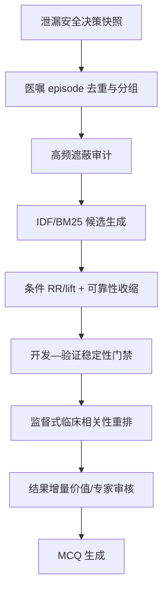

# chatgpt response

对应到你的项目，建议不要把它仅作为“换一个排名公式”，而应新增一个完整的“高频医嘱遮蔽识别与校正层”，放在 phenotype 之后、conditional rule mining 之前或之中。

总体流程可以改成：



## 一、先明确研究单位

你现在的原始单位是 `{subject_id, hadm_id}`，但检查选择问题真正的分析单位应当是：

$$
q=(hadm\_id,t)
$$

即某次住院中的某个决策时刻。

对每个决策时刻定义：

- $X_q$：时刻 $t$ 前已经可用的症状、生命体征、病史、既往医嘱和结果；
- $c$：候选检查/检验医嘱；
- $Y_{qc}=1$：在未来窗口 $(t,t+\Delta]$ 内开出医嘱 $c$；
- $Y_{qc}=0$：在有完整观察的情况下未开出 $c$。

时间窗口可以分别实验：时间窗口可以分别实验：

- 2 小时：即时急诊决策；
- 6 小时：早期诊断检查；
- 24 小时：入院初始检查路径；
- 下一次关键医嘱：纯序列任务。

要避免同一医嘱被多个重叠决策快照重复标成阳性。可以：

- 使用不重叠 landmark；
- 或将每个新医嘱只分配给最近的前一个合法决策点。

## 二、第一步不是加权，而是消除人为频率膨胀

高频可能来自两种不同机制：

1. 大量患者都会做；
2. 同一个患者被反复记录或反复开立。

IDF 只能处理第一种，第二种必须先通过事件处理解决。

### 1. 合并 POE 生命周期

利用你已有的：

- `chain_root_poe_id`；
- `chain_position`；
- `lifecycle_action`；
- `transaction_type`；
- `order_status_raw`；

把 create、modify、discontinue 等还原成一个 order episode。

不要将：

- 创建 CBC；
- 修改 CBC；
- 重新激活 CBC；

当作三个独立诊断动作。

建议生成字段：

```text
order_episode_id
order_concept_id
episode_start_time
episode_end_time
final_status
is_first_order_in_admission
is_repeat_order
repeat_interval_hours
order_set_id
panel_id
```

### 2. 对短时间重复进行 burst collapsing

例如，同一项检验在 6 小时内重复开立，可能是：

- 重复医嘱；
- 补采血；
- 医嘱状态变化；
- 监测，而不是新的诊断决策。

建议保留多个版本：

- `raw_count`：原始次数；
- `episode_count`：POE episode 数；
- `binary_presence`：当前窗口是否出现；
- `log_count = 1 + log(count)`；
- `first_order_only`。

后续消融实验可以证明，究竟是患者间普适性还是患者内重复性造成遮蔽。

### 3. panel 与 component 双层表示

例如 BMP 可能作为一个医嘱，但产生多个 labevents。

建议同时维护：

```text
order:panel:BMP
lab:Sodium
lab:Potassium
lab:Creatinine
...
```

但不能把一个 BMP 的七八个成分当作七八个独立医嘱，参与患者相似度累加，否则 panel 会成倍占据表示空间。

因此：

- 检查选择任务：优先使用 order/panel；
- 结果价值任务：使用 component/result；
- 图谱中建立 `panel_contains_component` 关系。

## 三、建立“高频遮蔽审计表”

这部分用于先证明问题存在，而不是直接假定存在。

建议在 development split 生成：

```text
order_frequency_stats.parquet
```

字段至少包括：

| 字段 | 含义 |
|---|---|
| `concept_id` | 医嘱概念 |
| `event_count` | 原始事件数 |
| `episode_count` | 医嘱 episode 数 |
| `patient_df` | 出现该医嘱的患者数 |
| `hadm_df` | 出现该医嘱的住院数 |
| `decision_df` | 可用决策点中出现的次数 |
| `patient_prevalence` | 患者级基线率 |
| `hadm_prevalence` | 住院级基线率 |
| `idf_patient` | 患者级 IDF |
| `idf_hadm` | 住院级 IDF |
| `repeat_ratio` | 重复医嘱占比 |
| `first_order_ratio` | 首次医嘱占比 |
| `order_set_ratio` | 来自 order set 的比例 |
| `setting` | ED/ward/ICU |
| `admission_phase` | 入院早期/中期/后期 |

IDF 建议同时计算两个版本：

$$
IDF_{\text{hadm}}(c)
=
\log \frac{N_{\text{hadm}}+1}{df_{\text{hadm}}(c)+1}
$$

$$
IDF_{\text{decision}}(c)
=
\log \frac{N_{\text{decision}}+1}{df_{\text{decision}}(c)+1}
$$

用途不同：

- `idf_hadm`：患者/住院表示和相似度；
- `idf_decision`：某一类决策节点的候选排名。

所有统计量只能在 development split 计算，然后冻结应用到 validation 和 final_test。

## 四、先量化遮蔽效应

### 1. 排名—频率相关性

对于当前 likelihood、PSR、selectivity 等排名，计算：

$$
\rho\left(
\log df(c),
score(c\mid X)
\right)
$$

并报告：

- Top-5/Top-10 中最高频 20%医嘱的比例；
- 每个频率分位进入 Top-k 的概率；
- 低频医嘱的平均排名；
- 高频医嘱删除前后的排名变化。

如果 likelihood 与全局频率高度正相关，而 lift/selectivity 相关性明显下降，就能直接支持你的假设。

### 2. 反事实重复实验

对同一组决策快照，人为进行：

- BMP/CBC/CXR 重复 1 次、2 次、4 次；
- 注入同科室常见但无目标特异性的医嘱；
- 删除最高频 1%、5%、10%医嘱；
- raw count 改为 binary presence。

标签保持不变，观察：

- 特异性检查 Recall@k ；
- NDCG@k ；
- 患者最近邻；
- 模型预测；
- 排名稳定性。

定义：

$$
MaskingSensitivity@k
=
Recall@k_{\text{original}}
-
Recall@k_{\text{perturbed}}
$$

校正方法的该值越接近零越好。

### 3. 高频占据率

定义：

$$
HighFreqOccupancy@k
=
\frac{\#\{\text{Top-k 中属于最高频分位的医嘱}\}}{k}
$$

如果 raw likelihood 的占据率很高，而真正路径相关医嘱的 recall 较低，就是很直观的遮蔽证据。

## 五、逆频率在你的项目中怎么用

逆频率更适合“表示和候选召回”，不建议单独作为最终 Gold 排名。

### 方案 A：TF-IDF

对每个决策快照构造医嘱向量：

$$
v_{qc}
=
TF_{qc}\times IDF(c)
$$

其中 TF 建议比较：

- binary；
- $1+\log TF$；
- raw TF，作为负面对照。

可用于：

- 患者相似度；
- 路径相似度；
- 从相似患者召回候选医嘱；
- 作为监督模型特征。

### 方案 B：BM 25

如果住院序列长度差异明显，BM 25 通常比 TF-IDF 更合适，因为它同时提供：

- 重复次数饱和；
- 序列长度归一化。

这对于 ICU 长住院特别重要，避免“记录多的患者与所有人都更相似”。

### 风险控制

不能直接把 IDF 最高的项目当作答案，因为可能是：

- 数据错误；
- 极罕见院内编码；
- content specificity 不足；
- 单次偶然事件；
- 与目标诊断无关。

因此必须经过下一层目标特异性筛选。

## 六、RR、lift、PMI 在你的规则挖掘中怎么用

对于条件组合 $X$ 和候选医嘱 $c$，建立：

| | 开出 $c$ | 未开出 $c$ |
|---|---:|---:|
| 满足条件 $X$ | $a$ | $b$ |
| 匹配背景 $B_X$ | $c_0$ | $d$ |

计算：

$$
Confidence=P(c\mid X)=\frac{a}{a+b}
$$

$$
RR=
\frac{P(c\mid X)}{P(c\mid B_X)}
$$

$$
PMI=
\log
\frac{P(c\mid X)}{P(c)}
$$

其中最关键的是背景 $B_X$ 怎么定义。

### 不建议使用全体住院作为统一背景

应匹配：

- ED/ward/ICU；
- 入院后时间；
- 当前科室；
- 是否术后；
- 病情严重程度；
- 之前是否已经开过该检查；
- 是否属于同一诊断候选人群。

例如 telemetry 在 ICU 中很普遍，在全院中不普遍。如果用全院作背景，它可能看起来高度特异；如果用同一 ICU 阶段作背景，lift 可能接近 1。

因此建议使用：

$$
P(c\mid B_X)
=
P(c\mid setting,\ phase,\ acuity,\ service)
$$

### 推荐使用收缩后的 log-RR

裸 PMI 会过度放大小样本。可以采用：

$$
S_{\text{assoc}}
=
\log
\frac{\tilde P(c\mid X)}
{\tilde P(c\mid B_X)}
$$

其中 $\tilde P$ 使用 Beta-Binomial 或简单加性平滑。

再加入可靠性：

$$
Reliability=
\frac{a}{a+\tau}
$$

形成：

$$
S_{\text{rule}}
=
S_{\text{assoc}}\times Reliability
$$

更稳健的方法是不用乘积，而直接按以下指标排序：

$$
P(RR>1+\delta\mid data)
$$

或者使用 log-RR 的可信区间下界。这样极低频但证据不稳定的规则不会进入前列。

## 七、将当前 V 1 比较改成严格的配对实验

你当前结果：

- selectivity：35.3%；
- likelihood：15.4%；
- PSR：23.3%；
- specificity×reliability：23.3%；

已经支持 selectivity 可能更好，但不同方法产生的候选数量可能不同，所以暂时不能作为最终结论。

下一轮应该固定：

- 相同条件组合；
- 相同候选医嘱集合；
- 相同支持度；
- 相同 Top-k；
- 相同时间窗口；
- 相同临床审核样本；

只替换分数：

1. `support`；
2. `confidence`；
3. `TF-IDF`；
4. `BM25`；
5. `raw lift/PMI`；
6. `shrunken log-RR`；
7. `PSR`；
8. `监督式重排`；
9. `IDF召回 + shrunken RR重排`。

这样才能判断改进到底来自频率校正还是候选集差异。

## 八、监督式权重在你的项目中怎么展开

建议先不要直接上 Transformer，而是建立一个可解释的 rule-level reranker。

### 输入单位

每一行是一条：

```text
condition_signature × candidate_order
```

### 特征

包括：

```text
support
confidence
patient_df
hadm_df
idf_hadm
idf_decision
lift
log_rr
reliability
development_validation_stability
first_order_ratio
repeat_ratio
order_set_ratio
time_to_order
setting
admission_phase
content_specificity
normalization_status
```

### 监督标签

最理想的是临床专家对规则进行 0–3 级评价：

- 0：无关或纯常规；
- 1：可能相关，但主要是常规/监测；
- 2：与鉴别诊断或筛查相关；
- 3：高度路径特异，适合作为检查选择题 Gold。

同时单独标注：

- `diagnostic`；
- `screening`；
- `monitoring`；
- `treatment_safety`；
- `routine_protocol`。

这样不会把每日 BMP 与疾病特异性检查混在一起。

### 首选模型

第一版建议：

- Elastic-net logistic/ordinal regression；
- 第二版再比较 LightGBM 或 LambdaMART。

监督模型学习的是：

$$
P(\text{clinically discriminative}\mid rule\ features)
$$

而不是单纯学习：

$$
P(\text{historically ordered}\mid X)
$$

后者只会更准确地模仿已有高频开单习惯。

## 九、深度序列模型中的高频校正

如果以后用 Transformer/attention 做检查选择，可加入：

### 1. 频率特征嵌入

给每个医嘱增加：

```text
frequency_decile
log_df
idf
first_or_repeat
order_set_flag
```

让模型学习频率的意义，而不是直接硬乘 IDF。

### 2. 高频 token dropout

训练时按全局频率对常规医嘱进行概率性 dropout：

- 高频常规事件 dropout 概率较高；
- 低频事件较低；
- 不能删除临床必需上下文；
- 只作为训练增强。

如果删除 BMP 后模型仍能发现特异性路径，说明它减少了对常规模式的依赖。

### 3. 目标端类别平衡

如果输出是下一项医嘱，可采用：

- inverse-frequency sampling；
- class-balanced loss；
- focal loss；
- frequency-stratified minibatch。

但必须同时报告 precision，因为过度提升罕见医嘱 recall 可能产生大量不合理的罕见检查推荐。

### 4. 不用 attention weight 单独证明重要性

至少增加：

- leave-one-order-out；
- 高频重复扰动；
- permutation importance；
- integrated gradients；
- 删除/插入实验。

## 十、开发、验证和测试门禁

建议规则经过以下门禁：

| 门禁 | 要求 |
|---|---|
| G 1 时间 | 所有条件信息在决策时刻已可用 |
| G 2 内容 | 医嘱概念明确，不是 unresolved 或 subtype-only |
| G 3 支持 | 条件和共现达到最低有效样本 |
| G 4 富集 | 收缩后 RR/lift 超过预设阈值 |
| G 5 稳定 | development 与 validation 方向一致 |
| G 6 频率 | 不是仅靠高基线概率进入排名 |
| G 7 目的 | 明确为诊断/筛查，而非纯监测或协议 |
| G 8 临床 | 专家认为可以作为合理决策 |
| G 9 测试 | final_test 只盲测一次 |

可以把全部规则指标保存为：

```text
conditional_rule_metrics_v2.parquet
```

而不是只保留最终一个总分。这样每条规则都可以审计为什么被保留或排除。

## 十一、评价指标分成三层

### 1. 是否解决高频遮蔽

- rank–frequency correlation；
- HighFreqOccupancy@k ；
- long-tail Recall@k ；
- frequency-stratified NDCG；
- MaskingSensitivity@k 。

### 2. 是否找到稳定路径

- development–validation Kendall $\tau$；
- 规则 Jaccard；
- validation lift/RR；
- 香港数据外部稳定性。

### 3. 是否提高题目质量

- 专家相关性评分；
- 诊断/筛查特异性；
- MCQ 正确答案唯一性；
- 干扰项合理性；
- LLM 题目难度；
- 不同频率分位的题目通过率。

不要只报告整体 Recall 或 AUROC，否则高频医嘱仍然可能主导平均结果。

## 十二、MCQ 生成时的额外约束

频率校正后发现“特异性医嘱”，不等于它自动成为规范性正确答案。

真实世界数据只能直接证明：

> 在这种情况下，医生经常或相对更倾向开出该医嘱。

不能自动证明：

> 这是临床上最合理的下一步检查。

因此正确答案应满足：

1. 在决策点后真实发生；
2. 在匹配背景中具有稳定富集；
3. 不是纯粹常规或监测动作；
4. 检查结果与后续诊断存在增量关联；
5. 经过指南或专家审核。

干扰项则建议：

- 匹配相同医嘱类型；
- 匹配相近基线频率；
- 在临床上具有一定合理性；
- 但目标特异性或时间合理性较低。

这样可避免题目变成“选最罕见的检查”。

## 十三、最现实的实施顺序

### 第一阶段：证明问题存在

不改模型，只完成：

- order episode 去重；
- 高频统计；
- rank–frequency correlation；
- 高频重复扰动；
- 频率分层 Recall/NDCG。

### 第二阶段：无监督校正

固定候选集，比较：

- confidence；
- TF-IDF/BM 25；
- raw lift；
- shrunken log-RR；
- PSR；
- IDF + shrunken RR。

这应该成为你的主要方法学实验。

### 第三阶段：临床标注与监督重排

对分层抽取的规则进行专家盲评：

- 高频/中频/低频；
- 不同评分方法；
- 不同医嘱类别；
- 诊断/监测/常规。

然后训练可解释的监督式 reranker。

### 第四阶段：结果价值与外部验证

最后才进入：

- 结果是否提供增量诊断信息；
- 是否改变处置；
- 香港数据迁移；
- MCQ 最终冻结。

最值得优先实现的主方案是：

$$
\boxed{
\text{episode去重}
\rightarrow
\text{IDF/BM25召回}
\rightarrow
\text{场景条件化的shrunken log-RR}
\rightarrow
\text{validation稳定性}
\rightarrow
\text{专家/监督重排}
}
$$

其中，对你当前以 Apriori 和 conditional rules 为主的 pipeline，真正的核心方法应是“场景条件化的收缩 RR/lift”；IDF 主要承担患者表示和候选召回，不能单独作为最终规则评分。

---
Powered by [AI Exporter](https://saveai.net)