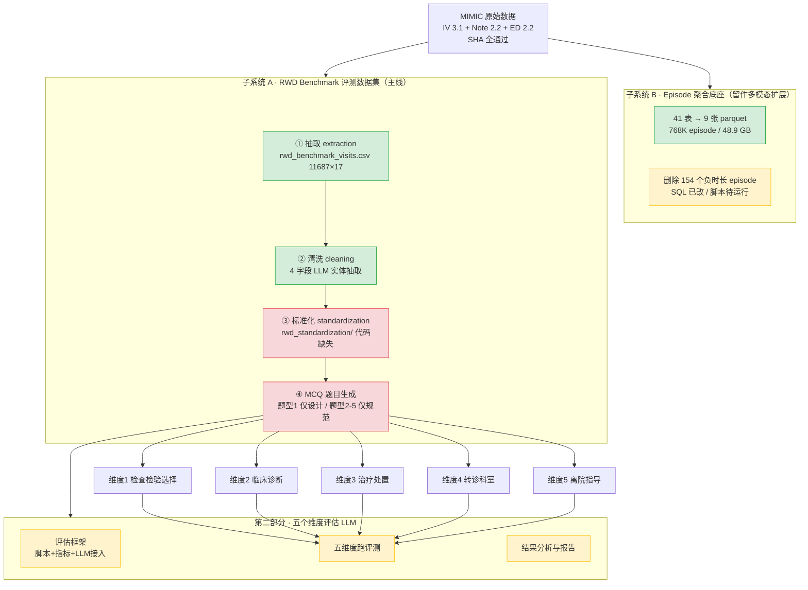

# MIMIC 临床 LLM Benchmark · 项目流程梳理与推进计划

> 生成日期：2026-08-06 ｜ 项目路径：`D:\Projects\llm_benchmark` ｜ 数据基线：MIMIC-IV 3.1 + Note 2.2 + ED 2.2

---

## 一句话定位

基于 **MIMIC** 构建临床 LLM 评测基准：先用 MIMIC 数据构建评测数据集（五类临床单选题），再用这五类题目从五个维度评估 LLM 的临床判断能力。当前**数据底座和上游抽取/清洗已完成，卡在标准化和出题两环**。

## 项目里的两条数据线

项目实际存在**两条并行、共享 MIMIC 原始数据但抽象层级不同**的线：

- **子系统 B · Episode 聚合底座**（`mimic_pipeline/` + `sql/episode_aggregation/`）：把 41 张 MIMIC 源表聚合成 episode 级全诊疗时间线（768K episode / 20.5 亿行 / 48.9 GB，在 G 盘）。**已基本完成**，只差 154 个负时长 episode 删除。这条线是留作**多模态扩展**的宏观数据底座，不直接出题。
- **子系统 A · RWD Benchmark 流水线**（`rwd_extraction/` → `rwd_cleaning/` → 标准化 → MCQ）：直接从 MIMIC 原始表抽 visit 级结构化数据（11,687 就诊 / 17 列），再生成五类题目。**这条是当前主线，也是"构建评测数据集"的核心**。

两者共享原始数据但**互不依赖**：子系统 A 直接读 MIMIC 原始表，不经过子系统 B 的 parquet。

## 整体流程图

> draw.io 可编辑版本见同目录 `项目流程图.drawio`，颜色规则：绿色=已完成，红色=阻塞，黄色=待办。

## 五个评估维度与数据就绪度

这是梳理里最关键的一环——**五个维度里只有两个数据真正就绪，其余都有缺口**：

| 维度 | 临床环节 | 题目设计 | 数据字段（17 列中） | 数据就绪 | 风险 |
|---|---|---|---|---|---|
| 1 检查检验选择 | 检查检验 | Stage 0-10 设计完整 | `investigation_reports`（需标准化） | ✅ 有数据 | `poe_detail` 99.99% 空，须依赖 reports |
| 2 临床诊断 | 诊断 | 仅题型规范 | `primary_diagnosis` + 病史字段 | ✅ 有数据 | 无 |
| 3 治疗处置 | 治疗 | 仅题型规范 | `medication_prescriptions` + `procedures` | ⚠️ 部分 | `procedures` 缺失 41% |
| 4 转诊科室 | 转诊 | 仅题型规范 | **17 列无对应字段** | ❌ 可能缺口 | `services`/`transfers` 未抽到 visit 级 |
| 5 离院指导 | 离院 | 仅题型规范 | `discharge_record` | ❌ **100% 空** | Follow-up 章节解析未命中 |

维度 4 和 5 是两个硬缺口，会直接影响"五个维度评估"能否真正展开。

## 推进顺序（门禁式）

按依赖关系排，**必须先解决阻塞，再逐维出题**：

### 第一部分：完成 MIMIC 评测数据集（子系统 A 主线）

| 编号 | 任务 | 状态 | 说明 |
|---|---|---|---|
| T0 | ① 抽取 · ② 清洗 | ✅ 已完成 | 产物在 `data/` |
| T1 | 修复 `discharge_record` 100% 空 | 🔴 P0 阻塞 | 排查 `rwd_extraction/discharge.py` 的 Follow-up 章节正则；阻塞维度 5 |
| T2 | 实现 `rwd_standardization/` 模块 | 🔴 P0 阻塞 | spec + 测试契约已就绪，只缺实现；阻塞全部出题 |
| T3 | 跑通标准化，产出 15 列标准化 CSV | ⏳ 待 T2 | 产出 `rwd_benchmark_visits_standardized.csv` |
| T4 | 补齐维度 4 转诊科室数据来源 | ⚠️ 待确认 | 确认是否需新增 `services` 抽取 |
| T5 | 实现维度 1 出题 | ⏳ 待 T3 | 已有 Stage 0-10 设计，可直接编码 |
| T6 | 设计并实现维度 2-5 出题 | ⏳ 待 T3-T4 | 目前只有题型规范，需先补出题方案 |

### 第二部分：五个维度评估

| 编号 | 任务 | 状态 | 说明 |
|---|---|---|---|
| T7 | 评估框架设计 | ⏳ 待 T5-T6 | 评测脚本、指标、LLM 接入、`subject_id` 级划分防泄漏 |
| T8 | 五个维度逐一评测 | ⏳ 待 T7 | 含人工/自动审题门禁 |
| T9 | 结果分析与报告 | ⏳ 待 T8 | — |

### 可并行收尾

| 编号 | 任务 | 状态 | 说明 |
|---|---|---|---|
| T-x | 子系统 B 删除 154 个负时长 episode | ⚠️ 待运行 | SQL 已改，跑脚本即可让数据底座闭环 |

## 关键判断

1. **当前真正的瓶颈是 T2（标准化）和 T1（discharge_record）**，不是出题。标准化模块的 spec 和测试都写好了，实现它就能解锁整条主线。
2. **维度 4、5 的数据缺口**意味着"五个维度评估"目前只有 2-3 个维度能真正跑起来。这需要在出题前先补数据，不能等做到维度 4/5 才发现没数据。
3. **凭据治理**（`run_*.sh` 里 `DEEPSEEK_API_KEY` 明文硬编码）是 P1 安全风险，建议在跑任何 LLM 流程前先改成环境变量。

## 关键文件索引

| 文件 | 作用 |
|---|---|
| `项目接手文档.md` | 最完整的接手文档，含数据契约、字段映射、运行方式 |
| `docs/MIMIC评测数据集构建方法学.md` | 方法学全文，覆盖数据来源→聚合→提取→清洗→标准化→出题 |
| `docs/mimic-multimodal-benchmark-guide.md` | 多模态数据与 benchmark 建设指南（含推荐下载清单） |
| `rwd_benchmark_extraction_spec.md` | 抽取规格 |
| `rwd_benchmark_cleaning_spec.md` | 清洗规格 |
| `rwd_benchmark_standardization_spec.md` | 标准化规格（T2 实现依据） |
| `mcq_generation/mcq_generation_design.md` | 题型 1 Stage 0-10 出题设计（T5 实现依据） |
| `mcq_generation/question_types.md` | 五类题型规范（T6 实现依据） |
| `tests/test_standardization.py` | 标准化测试契约（T2 验收依据） |
| `rwd_extraction/` | 抽取实现（8 模块） |
| `rwd_cleaning/` | 清洗实现（pipeline + prompts） |
| `mimic_pipeline/` | 子系统 B 聚合管线 |
| `sql/episode_aggregation/` | 子系统 B 聚合 SQL |
