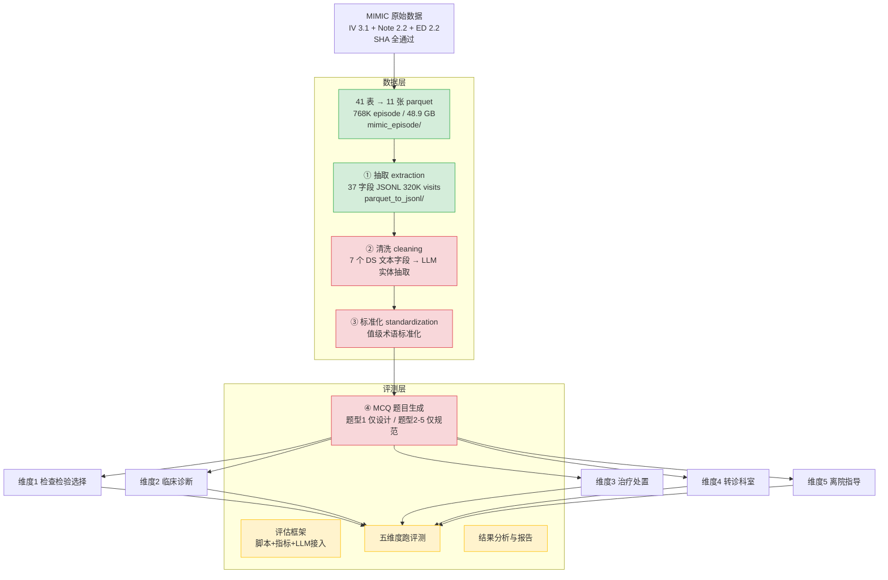

# MIMIC 临床 LLM Benchmark · 项目流程梳理与推进计划

> 更新日期：2026-08-07 ｜ 项目路径：`D:\Projects\llm_benchmark` ｜ 数据基线：MIMIC-IV 3.1 + Note 2.2 + ED 2.2
> Git：已初始化，远程 origin → `github.com/wangyaobupt/llm_benchmark`（未推送）

---

## 一句话定位

基于 **MIMIC** 构建临床 LLM 评测基准：先用 MIMIC 数据构建评测数据集（五类临床单选题），再用这五类题目从五个维度评估 LLM 的临床判断能力。当前 **数据层抽取已完成，卡在清洗、标准化和评测层出题**。

## 两层架构

项目从下到上分为**数据层**和**评测层**，数据层的产物直接喂给评测层出题。

- **数据层**：MIMIC 原始表 → episode 聚合（parquet）→ visit 级 37 字段 JSONL → 清洗 → 标准化。产出可直接消费的结构化临床数据。
- **评测层**：基于数据层产出，生成五类临床 MCQ 题目，再用题目评估 LLM 的五个维度临床判断能力。

> **旧版 17 列 CSV 路线**（`rwd_pipeline/`）：早期提取/清洗路线，已被数据层主线替代，保留代码和 spec 供参考。

数据层是一条串行管线：episode 聚合是抽取的上游，抽取是清洗的上游，清洗是标准化的上游。

## 整体流程图

> draw.io 可编辑版本见同目录 `项目流程图.drawio`，颜色规则：绿色=已完成，红色=阻塞，黄色=待办。

## 评测层：五个维度与数据就绪度

数据层的 37 字段 JSONL 已覆盖全部五个维度的数据需求：

| 维度 | MCQ 题型（评测层向 LLM 提出的问题） | 题目设计 | 数据字段（37 字段中） |
|---|---|---|---|
| 1 检查检验选择 | "该患者下一步最可能开什么检查？" | Stage 0-10 设计完整 | `investigations` |
| 2 临床诊断 | "该患者的诊断是什么？" | 仅题型规范 | `diagnoses` + 病史字段 |
| 3 治疗处置 | "该患者的首选治疗方案？" | 仅题型规范 | `treatments` |
| 4 转诊科室 | "该患者应转哪个科室？" | 仅题型规范 | `disposition.primary_service` + `discharge_location` |
| 5 离院指导 | "该患者离院后如何随访？" | 仅题型规范 | `narrative.discharge_instructions`（99.2% 覆盖率） |

## 推进顺序（门禁式）

按依赖关系排，**先完成数据层清洗标准化，再进入评测层出题**：

### 数据层

| 编号 | 任务 | 状态 | 说明 |
|---|---|---|---|
| T0 | Episode 聚合 | ✅ 已完成 | 41 表 → 11 张 parquet，`mimic_episode/` |
| T1 | ① 抽取 | ✅ 已完成 | 37 字段 JSONL，320K visits，`parquet_to_jsonl/` |
| T2 | ② 清洗：7 个 DS 文本字段 → LLM 实体抽取 | ⏳ 待办 | 多线程 + checkpoint 断点续跑 + fail-closed |
| T3 | ③ 标准化：值级术语标准化 | ⏳ 待办 | 诊断/药物/症状术语映射，双阶段 LLM |

### 评测层

| 编号 | 任务 | 状态 | 说明 |
|---|---|---|---|
| T4 | 实现维度 1 出题（检查检验选择） | ⏳ 待 T2-T3 | 已有 Stage 0-10 设计，可直接编码 |
| T5 | 设计并实现维度 2-5 出题 | ⏳ 待 T2-T3 | 目前只有题型规范，需先补出题方案 |
| T6 | 评估框架设计 | ⏳ 待 T4-T5 | 评测脚本、指标、LLM 接入、`subject_id` 级划分防泄漏 |
| T7 | 五个维度逐一评测 | ⏳ 待 T6 | 含人工/自动审题门禁 |
| T8 | 结果分析与报告 | ⏳ 待 T7 | — |

## 关键判断

1. **当前瓶颈是数据层 T2（清洗）和 T3（标准化）**。两个环节完成后评测层出题就能启动。
2. **凭据已治理**：`run_*.sh` 改为 `source .env`，不再明文硬编码 Key。
3. **Git 已初始化**：目录结构已按功能重组，待推送 GitHub。

## 关键文件索引

| 文件 | 作用 |
|---|---|
| `docs/design/MIMIC评测数据集构建方法学.md` | 方法学全文 |
| `docs/design/mimic-multimodal-benchmark-guide.md` | 多模态 benchmark 指南 |
| `docs/design/clinical_episode_aggregation_plan.md` | Episode 聚合实施方案 |
| `docs/design/episode_field_mapping.md` | 字段级映射 |
| `docs/reports/dashboard.html` | 动态进度仪表盘 |
| `docs/文件保存规范.md` | 目录职责与命名规范 |
| `mcq_generation/mcq_generation_design.md` | 题型 1 Stage 0-10 出题设计（T4 实现依据） |
| `mcq_generation/question_types.md` | 五类题型规范（T5 实现依据） |
| `tests/` | 测试套件（6 文件，覆盖抽取/清洗/标准化/episode pipeline） |
| `parquet_to_jsonl/` | 数据层主线（10 模块） |
| `mimic_episode/` | Episode 聚合管线 |
| `rwd_pipeline/` | 旧版 CSV 路线（抽取/清洗/标准化 + spec） |
